# (PART 1) 마이크로 서비스 개발을 위한 API 우선 설계 및 API 구축하기

## API Blueprint 문서 설계와 Microprofile 기반 Helidon을 활용한 서비스 개발, 그리고 Wercker CI까지!!!

### 전체 흐름도


### PART 1 실습하기
#### 1. API 설계 문서 (API Blueprint) 작성하기
<details>
<summary>Apiary 계정 생성하기</summary>
API 설계 문서를 작성하고 Mock Test를 하기 위한 Apiary 계정을 생성하는 단계입니다.  
만약 계정을 가지고 있다면 이 단계를 건너뜁니다.  

> [Apiary(https://apiary.io)](https://apiary.io) 홈페이지에 접속한 후 우측 상단의 **Sign up** 버튼을 클릭합니다.  
> 

> **Continue with GitHub** 버튼을 클릭합니다.  
> 

> GitHub 계정을 입력하고 **Sign In** 버튼을 클릭합니다.  
> 

> Apiary에서 GitHub에 인증을 위한 권한을 요청합니다.  
> **Authorize apiaryio** 버튼을 클릭합니다.  
> 

> Apiary에서 사용할 이메일을 입력합니다.  
> GitHub 이메일을 입력합니다.  
> 

> Apiary 계정을 처음 만들면 기본 API 프로젝트 하나를 생성해야 합니다.  
> **Name your first API** 부분에 다음과 같이 *Movie API*를 입력하고 문서 타입은 API Blueprint로 선택합니다.  
> Apiary는 Swagger와 API Blueprint 두가지를 지원 합니다. (참고 -> [API Blueprint and Swagger](#api-blueprint-and-swagger)
> 

> Apiary 계정과 첫 API Blueprint 프로젝트를 성공적으로 생성하였습니다. :clap:  
> 생성을 하게 되면 좌측에 샘플 API Blueprint 마크다운과 에디터가 보이고, 우측에 HTML 문서가 보입니다.  
> 
</details>

<details>
<summary>API Blueprint 설계 문서 작성하기</summary>

이제부터 Movie API 설계 문서를 작성합니다.  
> 아래의 API Blueprint 코드를 복사해서 좌측 에디터의 샘플 Blueprint를 덮어 씁니다. 
>```markdown
> FORMAT: 1A
> HOST: http://polls.apiblueprint.org/
> 
> # Movie API
> 
> 영화 정보를 제공하는 API 입니다.
> 
> ## Movie Collection [/movies]
> 
> ### List All Movies [GET]
> 
> + Response 200 (application/json)
> 
>         [
>             {
>                 "id": 19995,
>                 "title": "Avatar",
>                 "release_date": "2009.12.18",
>                 "runtime" : 100
>             },
>             {
>                 "id": 2699,
>                 "title": "Titanic",
>                 "release_date": "1997.12.19",
>                 "runtime" :194
>             }
>         ]
> 
> ### Get a Movie [GET /movies/{id}?title={title}]
> 
> Movie ID와 Title로 조회하는 API 입니다.
> 
> + Parameters
>     - id : 2699 (number, required)
>     - title : Titanic (string, optional)
>     
> + Request
>     + Header
>             
>             Authorization : Basic AAA
> 
> + Response 200 (application/json)
>     + Attributes
>         - id : 2699 (number, required)
>         - title : Titanic
>         - release_date : 1997.12.19
>         - runtime : 194
>         - Include MovieDetail
>         - genres (array[Genres])
> 
> 
> 
> # Data Structure
> 
> ## MovieDetail (object)
> - overview : In the 22nd century, a paraplegic Marine is dispatched to the moon Pandora on a unique mission, but becomes torn between following orders and protecting an alien civilization. (string)
> - status : Released
> - homepage : http://www.titanicmovie.com
> - vote_average : 7.2
> - vote_count : 12114
> 
> 
> ## Genres (object)
> - id : 18 (number, required)
> - name : Drama (string, required)
>```

> 요청/응답 데이터 정의는 두 가지 유형을 보여주기 위해 JSON 형식과 [MSON](#mson) 형식으로 정의하였습니다.  
> 자동으로 변환된 HTML문서를 오른쪽 영역에서 볼 수 있습니다.  
> **List All Movies**와 **Get a Movie**를 클릭하여 각각의 서비스 URL, 요청 파리미터 및 JSON 응답, Mock URL을 확인할 수 있습니다.  
> 우측 상단의 Save 버튼을 클릭하여 저장합니다.  
> 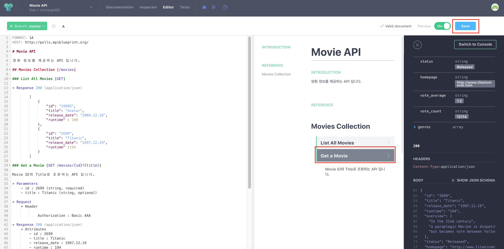

* * *
<details>
<summary>:point_right: (선택사항) 작성된 API Blueprint에 대한 설명으로 한번 읽어보세요. (클릭)</summary>

> 첫 번째 라인은 API Blueprint 버전 정도로 생각하면 됩니다.  
> 현재 API Blueprint spec은 1A revision 9 입니다.  
> ```markdown
> FORMAT: 1A
> ```
>
> 실제 서비스할 Production 서버의 주소입니다.  
> 처음에는 Production 환경이 없기 때문에 변경하지 않습니다.
> ```markdown
> HOST: http://polls.apiblueprint.org/
> ```
>
> API 문서 이름입니다. 한글도 가능합니다.
> ```markdown
> # Movie API
> ```
>
> API에 대한 설명, 소개를 적는 부분입니다.  
> ```markdown
> 영화 정보를 제공하는 API 입니다.
> ```
>
> API에 대한 엔드포인트 URL입니다.  
> ```markdown
> ## Movie Collection [/movies]
> ```
>
> API 엔드포인트에 대한 Action (GET/POST/PUT/DELETE)을 정의합니다.  
> ```markdown
> ### List All Movies [GET]
> ```
>
> 응답 JSON 샘플입니다.  
> ```markdown
>         [
>             {
>                 "id": 19995,
>                 "title": "Avatar",
>                 "release_date": "2009.12.18",
>                 "runtime" : 100
>             },
>             {
>                 "id": 2699,
>                 "title": "Titanic",
>                 "release_date": "1997.12.19",
>                 "runtime" :194
>             }
>         ]
> ```
>
> 두번 째는 파라미터를 받아서 조회하여 반환되는 Action입니다.  
> 다음과 같이 Path 파라미터(id)와 Query 파라미터(title) 정의합니다.  
> ```markdown
> ### Get a Movie [GET /movies/{id}?title={title}]
>
> Movie ID와 Title로 조회하여 상세 Movie 정보를 반환합니다.
> ```
>
> 요청 파라미터 부분입니다. JSON 샘플이 아닌 [MSON](#mson) 방식을 사용합니다.
> ```markdown
> + Parameters
>     - id : 2699 (number, required)
>     - title : Titanic (string, optional)
>
> + Request
>     + Header
>
>             Authorization : Basic AAA
> ```
>
> 응답 파라미터 부분입니다. JSON 샘플이 아닌 API Blueprint의 [MSON](#mson) 방식을 사용합니다.
> ```markdown
> + Response 200 (application/json)
>     + Attributes
>         - id : 2699 (number, required)
>         - title : Titanic
>         - release_date : 1997.12.19,
>         - runtime : 194
>         - Include MovieDetail
>         - genres (array[Genres])
>
>
>
> # Data Structure
>
> ## MovieDetail (object)
> - overview : In the 22nd century, a paraplegic Marine is dispatched to the moon Pandora on a unique mission, but becomes torn between following orders and protecting an alien civilization. (string)
> - status : Released
> - homepage : http://www.titanicmovie.com
> - vote_average : 7.2
> - vote_count : 12114
>
>
> ## Genres (object)
> - id : 18 (number, required)
> - name : Drama (string, required)
> ```
>
> 위 데이터 정의 방식은 API Blueprint에서 지원하는 MSON 이라고 하는 데이터 정의 스펙입니다.  
> [참고 -> MSON (Markdown Syntax for Object Notation)](#mson)
</details>

* * *

</details>

<details>
<summary>API Blueprint 코드를 GitHub으로 관리하기</summary>

작성된 API Blueprint 를 GitHub에 푸시하여 형상관리를 할 수 있습니다.  
이 작업을 위해서는 Apiary와 GitHub Sync가 되어야 하는데, 이 과정을 보여줍니다.

> 먼저 GitHub에 Repository를 하나 생성합니다.   
> GitHub에 로그인한 후 New repository를 클릭합니다.  
> 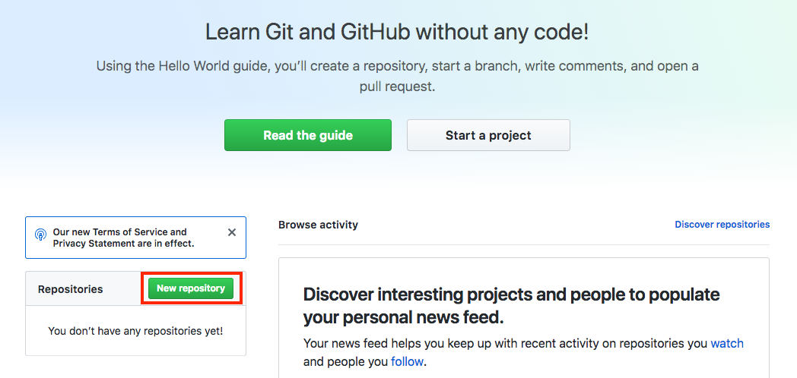

> Repository 이름을 입력합니다. 여기서는 *oraclecloud_api_handson* 이라는 이름으로 생성합니다.  
> 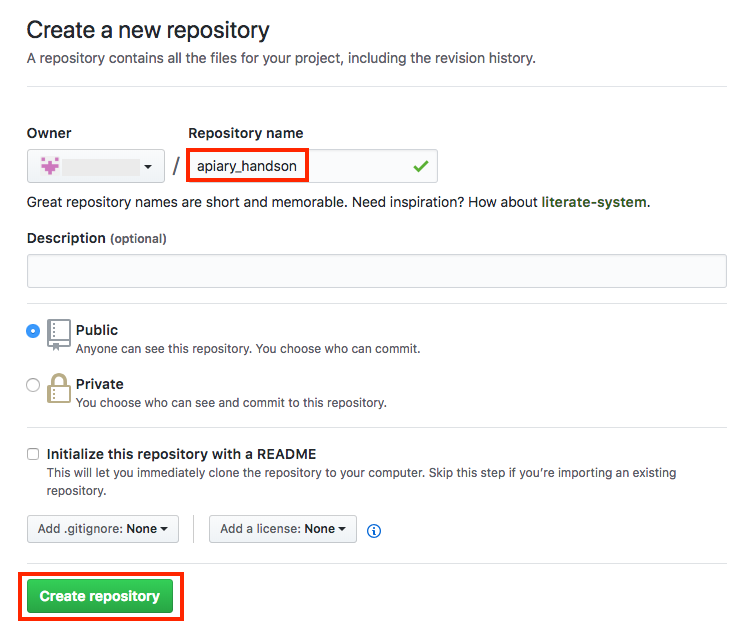

> 아래 Import code를 클릭합니다.  
> 본 과정에서 사용되는 소스와 설정파일을 포함한 Repository를 복제하여 생성할 것입니다. 
> 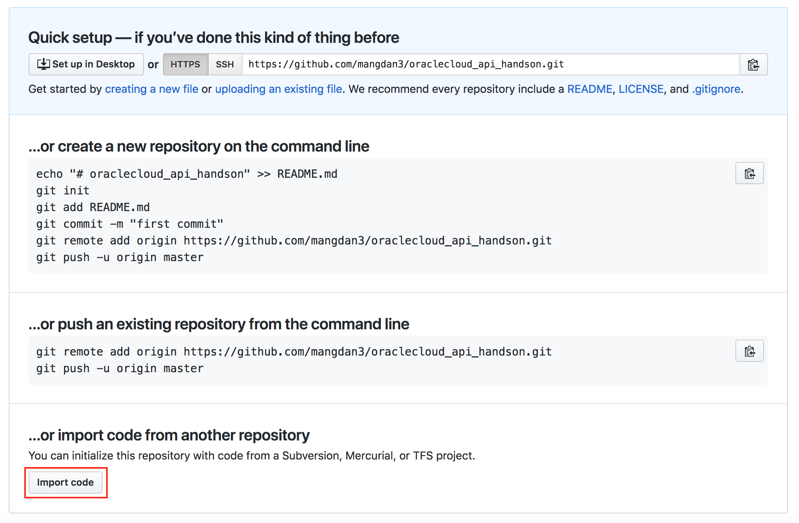

> clone URL에 아래와 같이 입력하고, Begin Import를 클릭합니다.  
> Import하는 레파지토리에는 Helidon 소스, Dredd 및 Wercker 설정 파일등이 포함되어 있으며, 이후 실습에서 사용됩니다.  
>```
> https://github.com/mangdan/oraclecloud_api_handson
>```
> 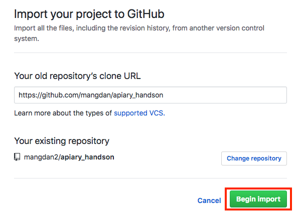

> GitHub Repository가 생성되었습니다.  
> Repository 링크를 클릭하면 Repository와 Import한 파일들을 확인 할 수 있습니다.  
> 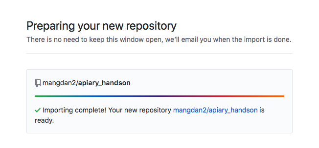

> 이제 Apiary 상단의 사람 모양 아이콘 옆 Settings 아이콘을 클릭합니다.  
> 이 Settings 는 작성한 문서에 대한 설정을 하기 위한 설정 버튼입니다.  
> 

> 맨 하단 *Link your GitHub account* 버튼을 클릭합니다.  
> 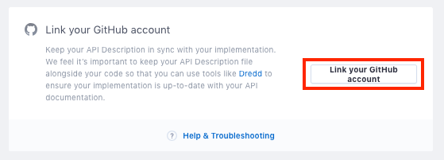

> *List all repositories* 버튼을 클릭합니다.  
> 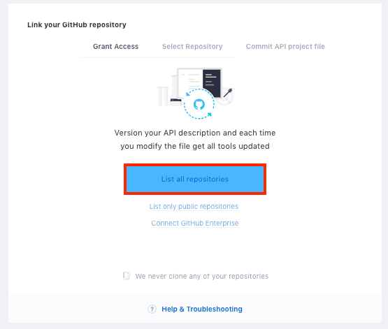

> Apiary가 GitHub 접근 권한을 부여하기 위해 *Authorize apairyio* 버튼을 클릭합니다.  
> 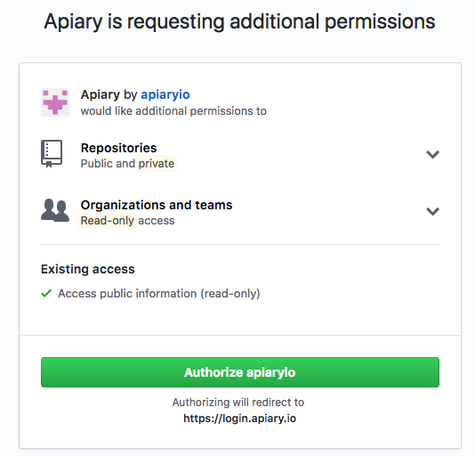

> 다시 아래 *Link your GitHub account* 버튼을 클릭하면 다음과 같이 생성한 repository를 선택할 수 있습니다.  
> 옆의 Connect 버튼을 클릭합니다.  
> 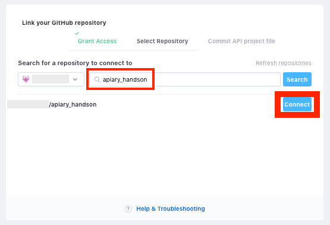
 
> *Commit and start sync* 버튼을 클릭합니다.  
> 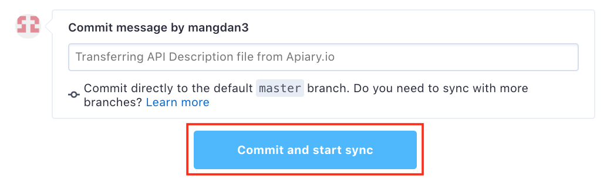

> 작성한 API Blueprint문서와 GitHub Repository가 싱크됩니다.  
> 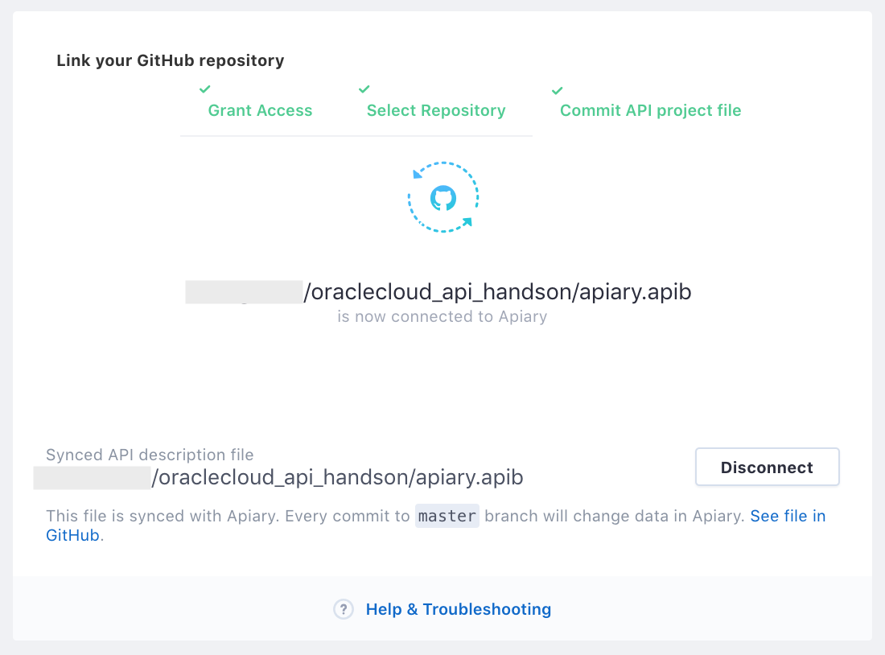

> 다시 상단의 Editor 버튼을 클릭하면 우측 **Save** 버튼 옆에 **Push** 버튼이 생성 된 것을 확인하실 수 있습니다.  
> 이제 문서를 변경하면 변경이 되었다는 알림(빨간점)이 Push 버튼에 나타나며, Push 버튼을 클릭하여 GitHub에 바로 푸시할 수 있습니다.  
> 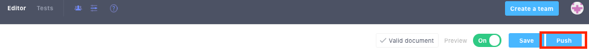

> GitHub Repository에는 apiary.apib 파일이 생성됩니다.  
> GitHub에 생성된 파일을 클릭하여 내용을 확인합니다.  
> 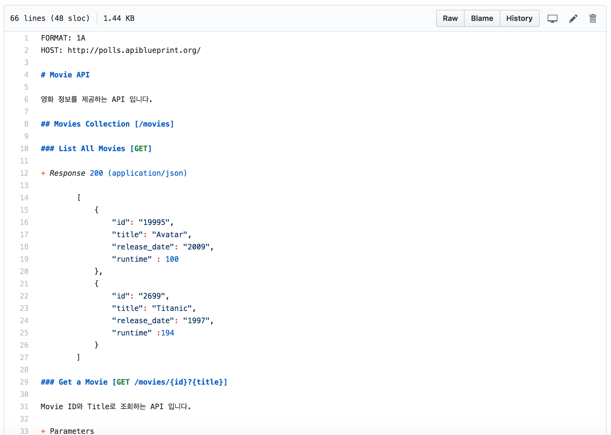
</details>

#### 2. Helidon을 활용하여 마이크로 서비스를 개발하고 API 설계 문서와 일치 여부 테스트하기
<details>
<summary>Helidon MP (MicroProfile) 프로젝트 생성 및 서비스 만들기</summary>

> 작업은 Visual Studio Code를 통해서 진행합니다.  
> Visual Studio Code를 실행하고 Visual Studio Code 상단 터미널을 클릭하고 새 터미널을 오픈합니다.  
> 다음과 같이 Maven Path와 Java Home 환경 변수를 체크합니다.
>    - **Visual Studio Code 터미널: Windows PowerShell 기준**
> ```
> mvn -version
> echo $env:JAVA_HOME
> ```
> 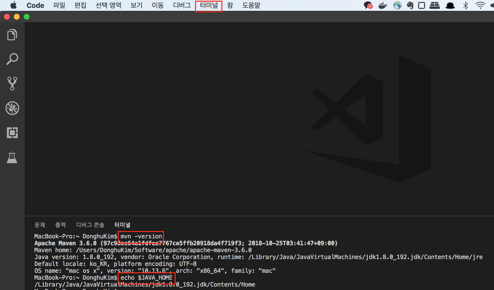

<details>
<summary>&nbsp;&nbsp;&nbsp;&nbsp;:point_right: (선택사항) Maven Path와 Java Home 변수 설정 안되어 있을 경우 (클릭)</summary>

> Maven Path와 Java Home 설정이 안되어 있을 경우 Windows Command 창을 열고 다음과 같이 실행합니다.  
> 아래 Maven과 JDK는 자신의 PC 설치 위치를 확인하고 설정하여야 합니다.
> ```
> setx path "%PATH%;c:\Oracle\apache-maven-3.6.0\bin"
> 
> setx JAVA_HOME "c:\Program Files\Java\jdk1.8.0_202"
> ```
</details><br>

> 여기서는 MicroProfile 기반 Helidon 프로젝트로 API를 개발합니다. [참고 -> Helidon](#helidon)  
> ***실습 시간 관계상 미리 생성한 프로젝트로 진행합니다.***  
> 만약 c:\Oracle\workspace\helidon-moviesvc-mp 프로젝트 폴더가 없을 경우  
> 아래 ***Helidon MP/SE 템플릿 프로젝트를 새로 생성하는 방법*** 을 참고하시기 바랍니다.  
> Visual Studio Code 좌측 상단의 아래 이미지 클릭, **폴더 열기** 버튼 클릭 후  
> c:\Oracle\workspace 폴더를 선택하고 열기를 클릭합니다.  
> 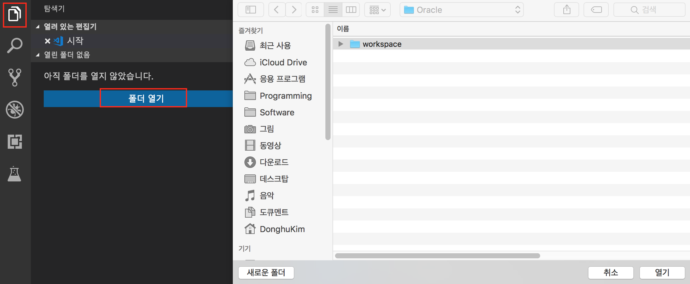

> 기본 Helidon MP Project Template Structure 입니다.  
> 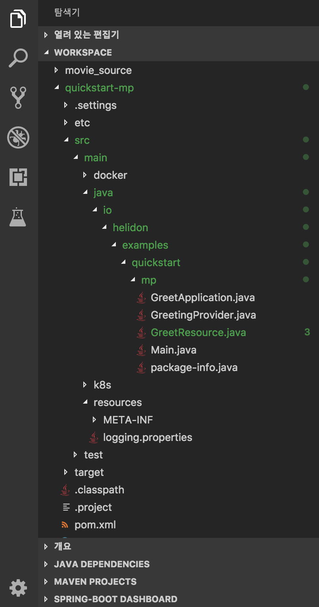

> Visual Studio Code 터미널에서 생성한 프로젝트 폴더로 이동 후 다음과 같이 패키징 및 서비스 실행합니다.  
> :large_orange_diamond: 명령어 실행은 생성한 Helidon 프로젝트 폴더 안에서 실행합니다.
>    - **Visual Studio Code 터미널에서 수행**
> ```
> cd c:\Oracle\workspace\helidon-moviesvc-mp
>
> mvn package
>
> java -jar target/helidon-moviesvc-mp.jar
> ```

> 다음과 같이 브라우저로 접속해봅니다.  
> Helidon 템플릿으로 생성한 샘플 REST API 수행결과를 확인합니다.
>```
> http://localhost:8080/greet
>```
> 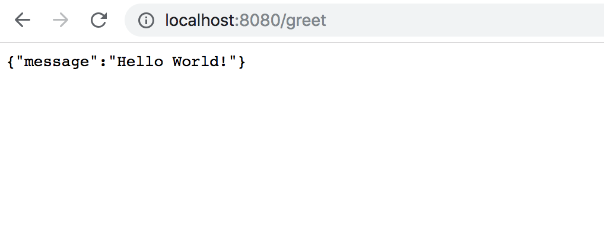  
>
> **VS Code 터미널에서 Ctrl + C로 실행중인 프로세스를 종료합니다.**  

***

<details>
<summary>:point_right: (선택사항) Helidon MP/SE 템플릿 프로젝트를 새로 생성하는 방법 (클릭)</summary>

Maven generate (참조 -> [Maven Generate Option](#maven-generate-option)를 통해 Helidon 템플릿 프로젝트와  
디자인 타임 라이브러리, 런타임 라이브러리를 다운로드 받습니다. 네트워크 환경에 따라 대략 5분 ~ 10분 가량 소요됩니다.  
다음은 실행 명령어 예제입니다. 실습에서는 Helidon (MP)만 생성합니다.  
workspace 폴더 하위에 생성하므로 해당 폴더로 이동합니다.  
:exclamation: Maven generate는 현재 Windows PowerShell에서 오류가 발생합니다.  Windows Command에서 실행하세요.  
> ```
> cd c:\Oracle\workspace
> ```

다음을 실행합니다. 
> Helidon MP 
> ```
> mvn archetype:generate -DinteractiveMode=false -DarchetypeGroupId=io.helidon.archetypes -DarchetypeArtifactId=helidon-quickstart-mp -DarchetypeVersion=0.11.0 -DgroupId=io.helidon.examples -DartifactId=helidon-moviesvc-mp -Dpackage=io.helidon.examples.quickstart.mp
> ```

**Helidon SE는 본 실습에서 사용하지 않습니다.**
> Helidon SE
> ```
> mvn archetype:generate -DinteractiveMode=false -DarchetypeGroupId=io.helidon.archetypes -DarchetypeArtifactId=helidon-quickstart-se -DarchetypeVersion=0.11.0 -DgroupId=io.helidon.examples -DartifactId=helidon-moviesvc-mp -Dpackage=io.helidon.examples.quickstart.se
> ```

> 관련된 라이브러리와 메이븐 플러그인을 다운로드 받습니다.  
> 다운로드가 완료되면 다음과 같이 Build Success 화면을 볼 수 있습니다.  
> 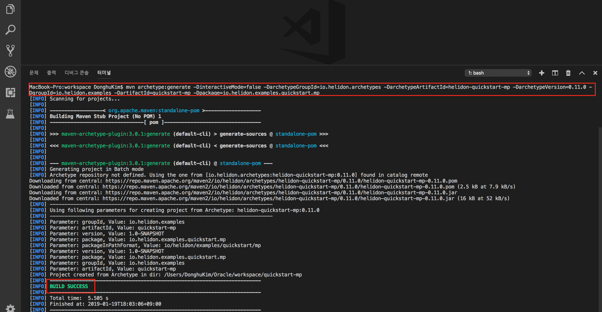

> Helidon MP Project Template Structure입니다.  
> 

> 생성된 프로젝트 폴더로 이동 후 다음과 같이 패키징을 합니다.  
> :large_orange_diamond: 명령어 실행은 생성한 Helidon 프로젝트 폴더 안에서 실행합니다.
>    - **Visual Studio Code 터미널에서 수행**
>```
> cd helidon-moviesvc-mp
>
> mvn package
>
> java -jar target/helidon-moviesvc-mp.jar
>```
</details>

***

Apiary에서 설계한 문서 (Movie API) 기반으로 간단하게 개발된 소스를 활용하여 패키징 및 테스트합니다.   
> VS Code 터미널에서 Ctrl + C로 실행중인 프로세스를 종료합니다.  
> 다음과 같이 처음 생성한 본인의 GitHub 계정에서 관련된 소스를 로컬로 Clone합니다. (apiary blueprint 포함)  
> ***실습 시간 관계상 미리 다운로드 받은 레파지토리로 진행합니다. 아래 단계는 건너뜁니다.***  
> ***만일, c:\Oracle\oraclecloud_api_handson 폴더가 없을 경우 다음 git clone을 실행하세요.***  
>```
> git clone https://github.com/{본인깃헙계정명}/oraclecloud_api_handson c:\Oracle\oraclecloud_api_handson
>```

> GitHub에서 받은 Helidon 프로젝트로 미리 구현해 놓은 Movie API 소스를 내 프로젝트로 복사합니다.  
>```
> cp c:\Oracle\oraclecloud_api_handson\movie_api\movie*.json c:\Oracle\workspace\helidon-moviesvc-mp\src\main\resources
>
> cp c:\Oracle\oraclecloud_api_handson\movie_api\*.java c:\Oracle\workspace\helidon-moviesvc-mp\src/main/java/io/helidon/examples/quickstart/mp
>```
> 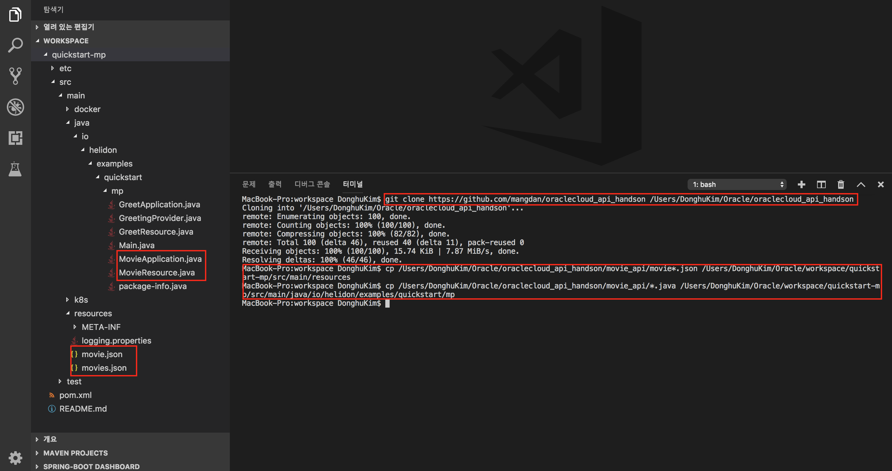

> 포로젝트를 다시 패키징 및 실행합니다.   
> :large_orange_diamond: 명령어 실행은 생성한 Helidon 프로젝트 폴더 안에서 실행합니다.
>    - **Visual Studio Code 터미널에서 수행**
>```
> cd c:\Oracle\workspace\helidon-moviesvc-mp
> 
> mvn package
>
> java -jar target/helidon-moviesvc-mp.jar
>```
> 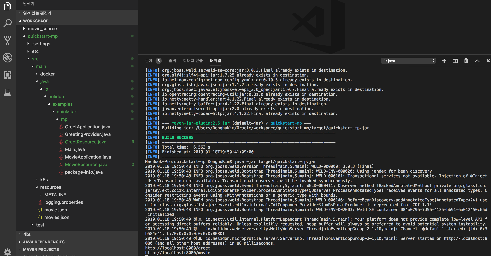

> 다음과 같이 브라우저로 접속해봅니다.
> Helidon 템플릿으로 생성한 샘플 REST API가 이제 구현되어 Movie API로써 수행결과를 확인합니다.
>```
> http://localhost:8080/movies
>
> http://localhost:8080/movies/2699?title=titanic
>```
> 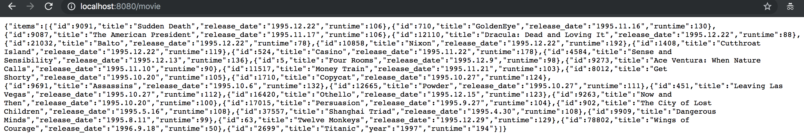
> 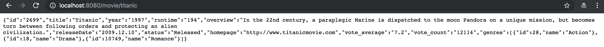  
> **VS Code 터미널에서 Ctrl + C로 실행중인 프로세스를 종료합니다.**  
</details>

<details>
<summary>Dredd를 활용하여 API 설계문서와 서비스간의 일치 여부 검증하기</summary>

Dredd([참고 -> Dredd](#dredd))는 Apiary에서 주도하는 오픈소스이며, API 문서와 구현된 서비스간 일치 여부를 검증,  
테스트하는 도구입니다. 현재 API Blueprint와 Swagger를 지원합니다.  

> Apiary에 접속해서 Movie API 상단 **Tests**을 클릭합니다.  
> Tutorials 탭을 클릭하면 다음과 같이 3 스탭으로 Dredd 테스트를 수행하도록 가이드를 볼 수 있습니다.  
> 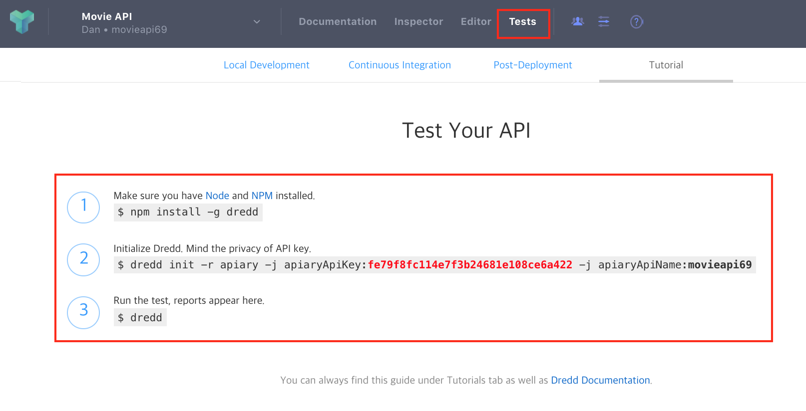

> 위 작업을 순서대로 수행합니다.  
> Visual Studio Code의 터미널 환경에서 Dredd Install 작업을 수행합니다.  
> 작업 위치는 Helidon Project (quickstart-mp) 입니다.  
>    - **Visual Studio Code 터미널에서 수행**

> 1. Dredd 툴을 설치합니다.  
>```
> npm install -g dredd 
>```
> 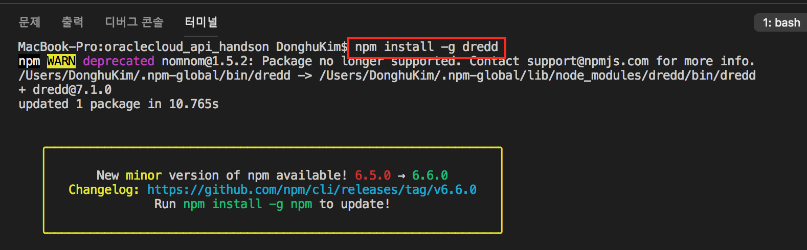

> 2. dredd init 명령을 수행합니다.  
> 참고로 로컬 테스트를 위해서는 Apiary에서 다운로드 받은 API Blueprint 파일 (확장자 .apib)이 필요합니다.  
> 실습 시간 관계상 helidon-moviesvc-mp 폴더에 사전에 다운로드 받아 준비되어 있습니다.(apiary.apib)  
> **여기서 apairyApikey와 ApiaryApiName은 본인의 Apiary 문서로 리포트를 전송하기 위해 사용됩니다.**  
> <code><pre>dredd init -r apiary -j apiaryApiKey:<B>{본인의 apiaryApiKey}</B> -j <B>apiaryApiName:{본인의 apiaryApiName}</B>
> 
> ? Location of the API description document <B>apiary.apib</B>
> ? Command to start the API server under test <B>java -jar target/helidon-moviesvc-mp.jar</B>
> ? Host of the API under test <B>http://localhost:8080</B>
> ? Do you want to use hooks to customize Dredd's behavior? <B>Y</B>
> ? Programming language of the hooks <B>JavaScript</B>
> ? Found Travis CI configuration, do you want to add Dredd? <B>N</B>
> </pre></code>
> 
>> **선택사항)** 만일 본인이 직접 작성한 API Blueprint 파일을 사용하고 싶으면 다음 명령어로 직접 다운로드 받아서  
>> 진행하시기 바랍니다. 참고로 Windows Powershell 명령어 이므로 Visual Studio Code 터미널에서 수행하며,  
>> DownloadFile URL에서 apiaryApiName은 위에 메모한 apiaryApiName 이름으로 변경하여 실행합니다.  
>>    - **Windows Powershell 명령어 이므로 Visual Studio Code 터미널에서 수행**  
>>    - **DownloadFile URL에서 apiaryApiName은 위에 메모한 apiaryApiName 이름으로 변경하여 실행합니다.**  
>>```
>> (New-Object Net.WebClient).DownloadFile('https://{apiaryApiName}.docs.apiary.io/api-description-document','c:\Oracle\workspace\helidon-moviesvc-mp\apiary.apib')

> 3. Dredd.yml 파일이 생성되었습니다. Dredd.yml 파일을 이용하여 Dredd를 실행합니다.  
>```
> dredd
>```

> 

> Apiary Tests 로 다시 들어가보면 테스트 결과 리포트를 볼 수 있습니다.  
> ** Apiary에서 정의한 Movie API 스펙에 맞게 Helidon기반 REST API가 잘 구현되었는지 테스트한 결과 입니다. **
> 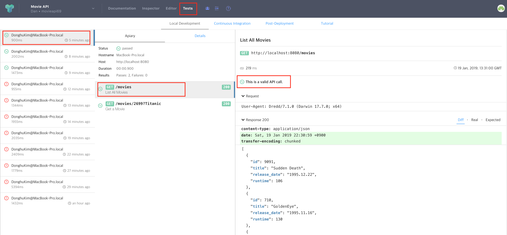
</details>


#### 3. Wercker와 Dredd, Github을 사용하여 지속적 통합 테스트 환경 구축하기

<details>
<summary>GitHub의 Dredd.yml 파일 업데이트 및 커밋</summary>
 
> Continuous Integration & Delivery 솔루션인 Wercker는 GitHub과 같은 SCM과 연결되어 동작합니다.  
> 여기서는 처음에 생성한 GitHub Repository를 연결하여 진행합니다.  
>```
> https://github.com/{본인깃헙계정명}/oraclecloud_api_handson
>```

> 위 GitHub Repository에는 Wercker와 Helidon 소스, 기타 관련 설정 파일들이 포함되어 있으며,  
> Wercker는 wercker.yml 파일에 기술된 스탭과 파이프라인을 기반으로 실행됩니다. [(참고 -> Wercker Config)](#wercker-config)  
> 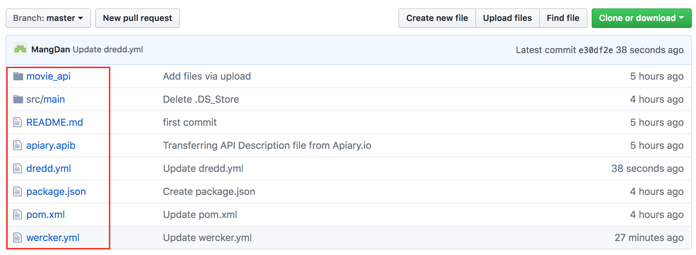

> 여기서 Dredd.yml의 apiaryApiKey와 apiaryApiName은 본인이 만든 API Blueprint를 기준으로 변경해야 합니다.  
> Apiary의 상단 Tests 링크를 클릭하고 Tutorial 탭에서 dredd init 라인에 있는 apiaryApiKey와 apiaryApiName을 복사합니다.  
> 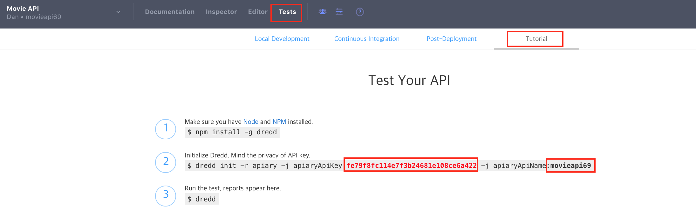

> GitHub Repository로 가서 dredd.yml파일을 클릭하고 우측 상단의 연필 아이콘을 클릭합니다.
> 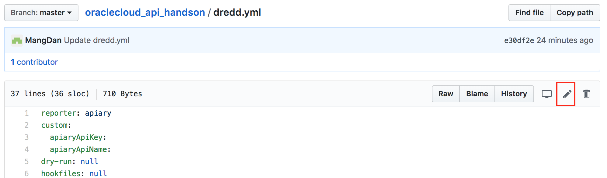

> 다음과 같이 본인의 apiaryApiKey와 apiaryApiName 값으로 수정하고 하단 **Commit Changes** 버튼을 클릭하여 커밋합니다.  
> 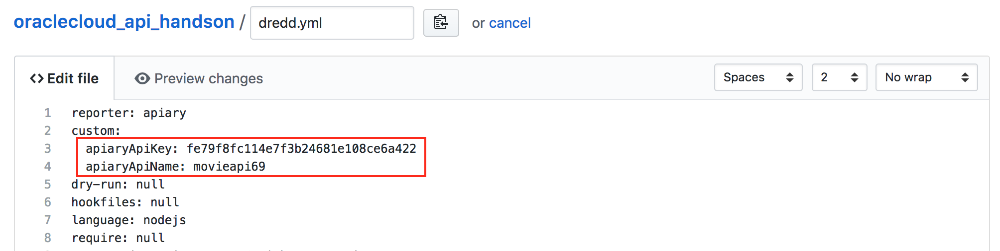
</details>
 
<details>
<summary>Wercker 계정 생성 및 빌드</summary>

> [Wercker 바로가기](https://app.wercker.com)  
> Wercker는 컨테이너 기반의 CI/CD 도구입니다. Dredd로 로컬에서 간단히 테스트를 할 수 있지만, 구현 API 수가 많아지면,
> Wercker와 GitHub을 활용하여 개발 소스 Commit과 동시에 자동으로 테스트를 수행하도록 하여, 검증 및 테스트 및 결과 리포트을 자동화할 수 있습니다.
> 우선 GitHub 계정을 활용하여 Wercker 계정을 생성합니다.  
> [Wercker](#http://app.wercker.com)에 접속합니다. 상단의 **Sign Up** 버튼을 클릭합니다.  
> 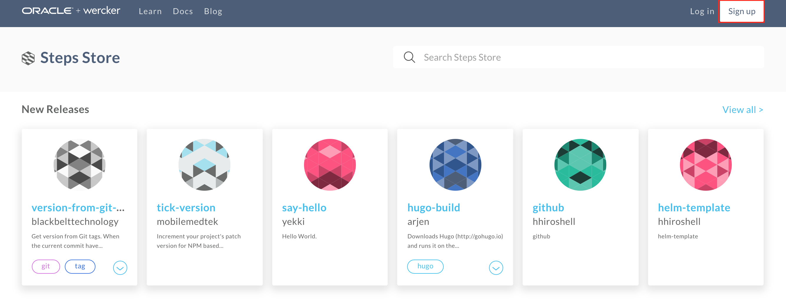

> **SIGN UP USING GITHUB** 버튼을 클릭하고 GitHub 아이디와 패스워드를 입력합니다.  
> 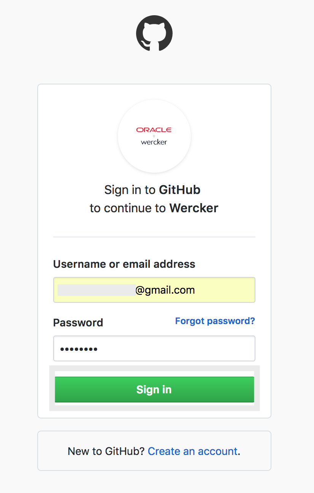

> **Authorize wercker** 버튼을 클릭합니다.  
> 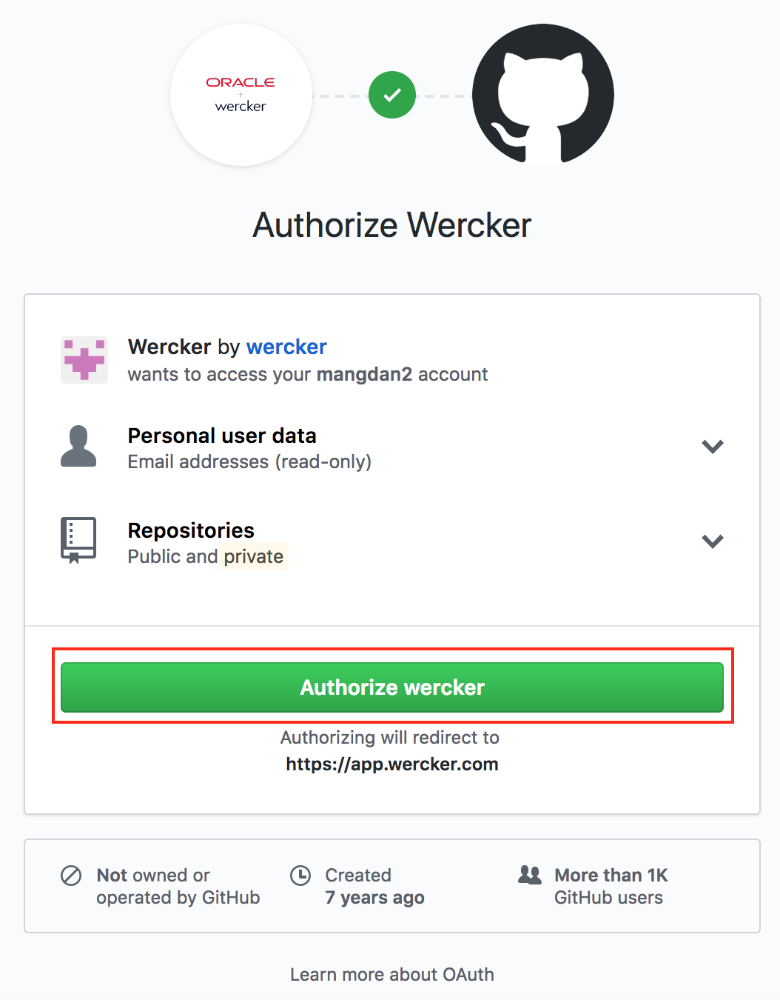

> Name, Email을 입력하고 **FINISH UP** 버튼을 클릭합니다.  
> 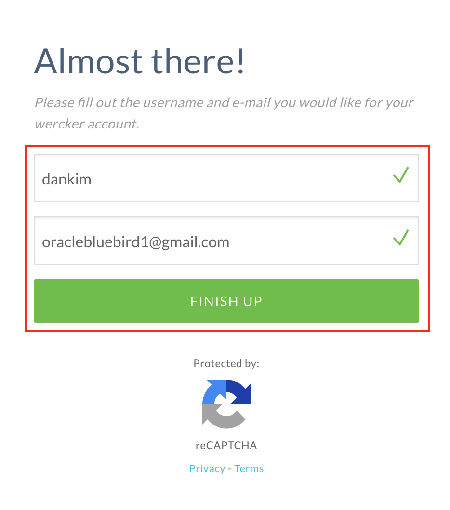

> **Create your first application** 버튼을 클릭합니다.  
> 혹은 우측 상단의 + 버튼을 클릭하고, Add Application을 선택합니다.  
> 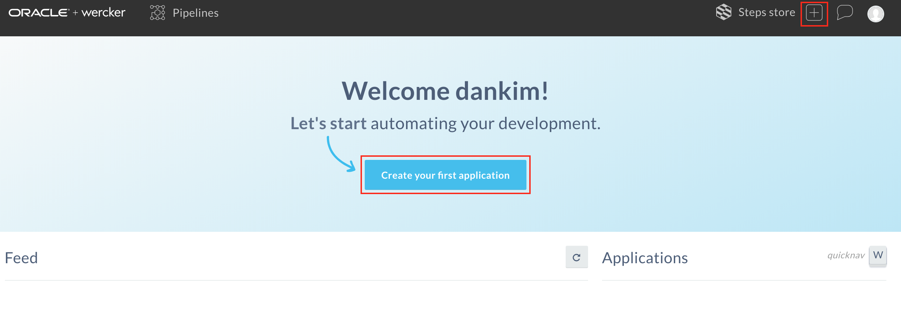

> 다음과 같이 SCM을 GitHub으로 선택하고 Next 버튼을 클릭합니다.  
> 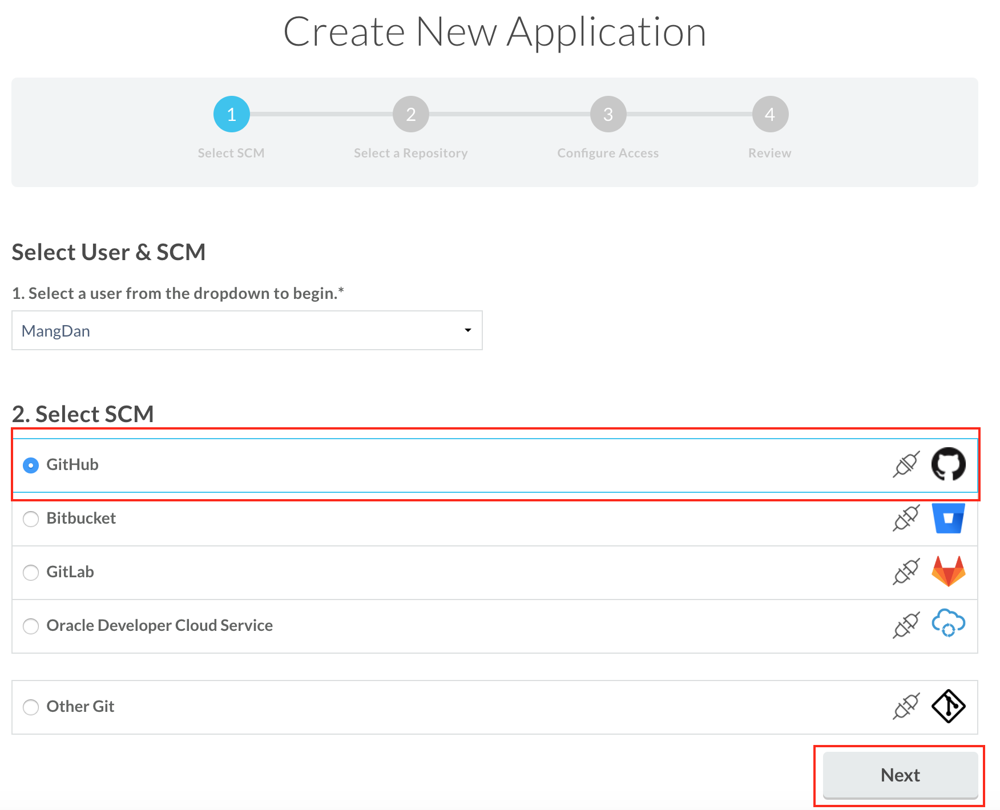

> GitHub Repository를 선택합니다.  
> 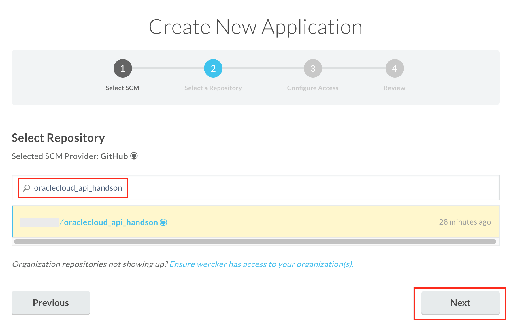

> **Wercker will check out the code without using an SSH key** 선택합니다.  
> 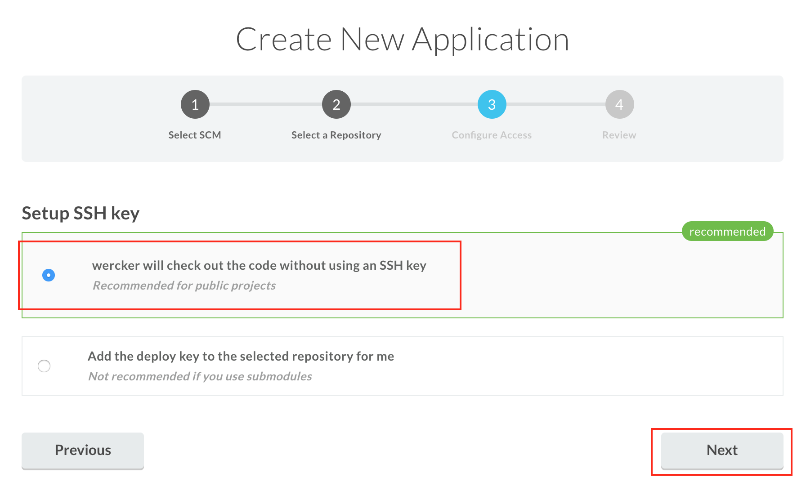

> **Create** 버튼을 클릭하여 Wercker Application을 생성합니다.  
> 혹은 우측 상단의 + 버튼을 클릭하고 Add Application을 선택합니다.  
> 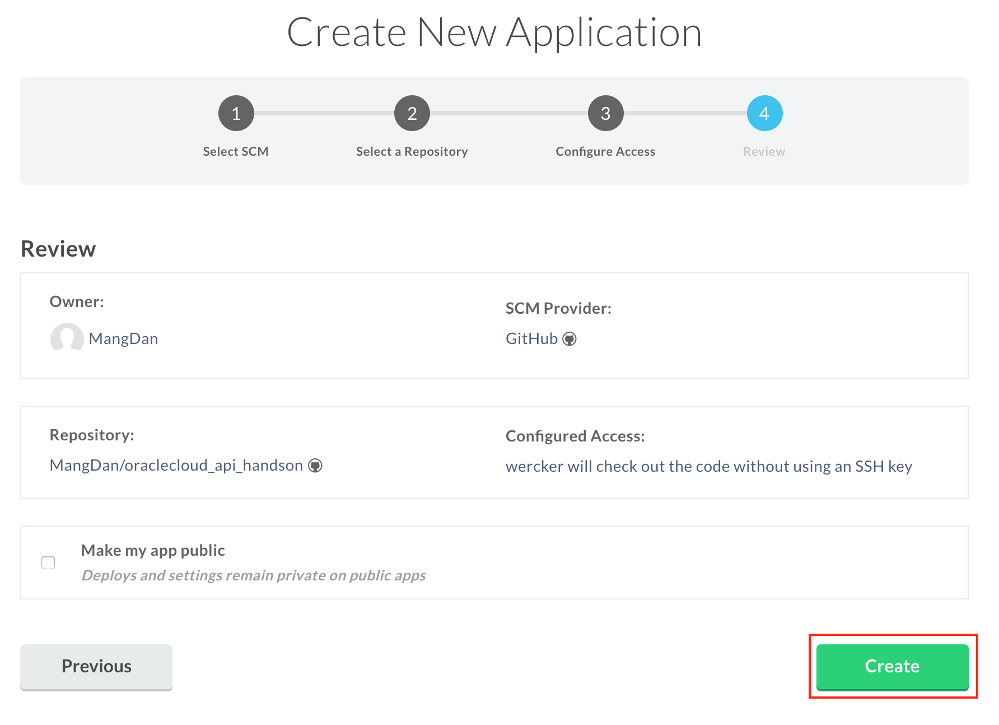

> Wercker Application을 성공적으로 생성하였습니다.  
> 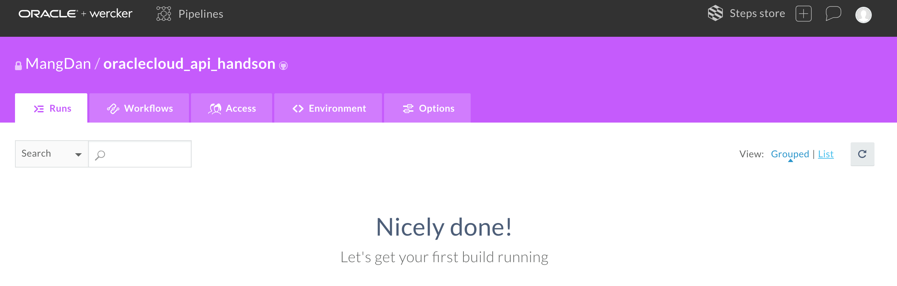

> 맨 아래 **trigger a build now** 버튼을 클릭하면 빌드가 시작됩니다.  
> 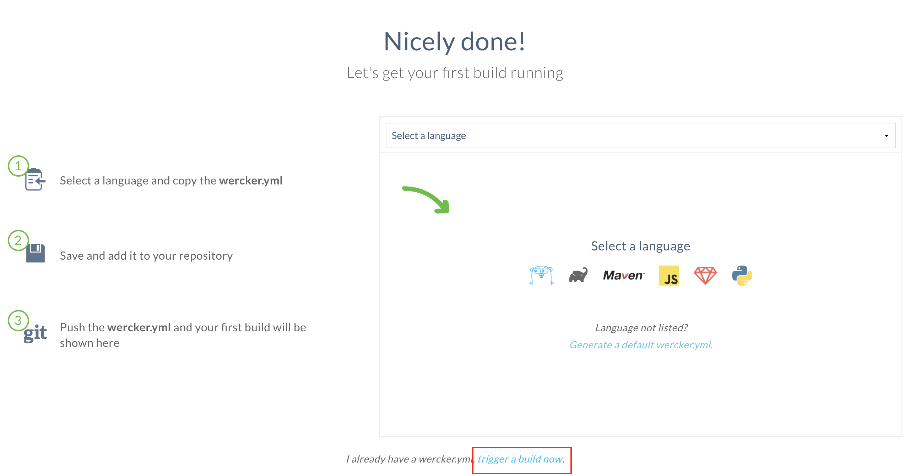

> 구성한 Wercker Application에 의해 빌드가 진행되는 상황과 내역을 볼 수 있습니다.  

> Wercker trigger가 작동하면서 자동으로 Build가 시작되는 것을 확인할 수 있습니다.  
> 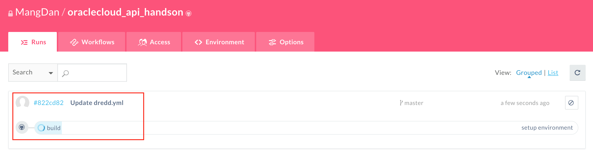

> Wercker에서 Build 및 Test가 오류 없이 완료되었습니다.  
> 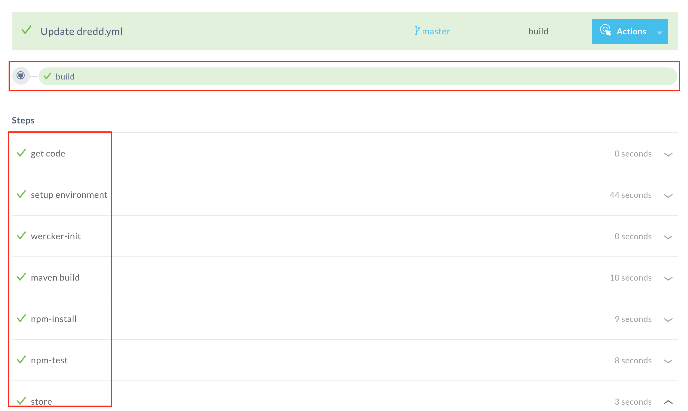

> Apiary의 Tests로 들어가서 **Continuous Integration**을 클릭하면 다음과 같이 Dredd가 전송한   
> 결과 리포트를 확인할 수 있습니다.  
> 
>
>> 오류난 상황을 만들어보고 싶으면 다음 Apiary에서 작성한 Movie API의 44번째 라인을 다음과 같이 수정하고  
>> 우측 상단의 Save, Push를 하면 오류 및 오류 정보를 Apiary에서 확인할 수 있습니다. **(선택사항 입니다.)**
>>```
>> - id : 2699 (number, required)    ---->     - id : 2699 (string, required)
>>```

> API Blueprint 문서와 API 소스가 변경이 일어나면 Wercker에 의해서 자동으로 문서 호환 여부를 체크하여 결과를  
> 다양한 채널 (Apiary, 이메일, Slack 등)로 전송해줍니다.  
> Wercker가 CI/CD 솔루션이므로 모든 테스트를 마친 API는 최종적으로는 다양한 운영 환경에 자동 배포가 되며, 
> API 문서와 서비스를 항상 최신의 상태로 유지시켜 줍니다.  

> 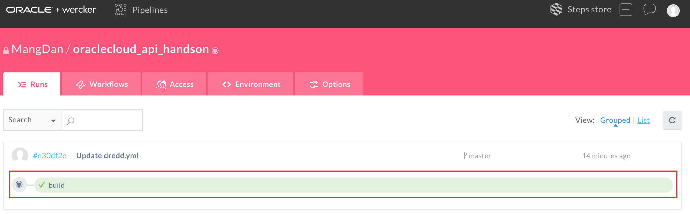
</details>

- [홈으로 가기](README.md)  
- [PART2 가기](HOL-PART2.md)
<br><br><br><br>

## 참고
#### API Blueprint and Swagger
> API Blueprint와 Swagger는 API 문서 작성 시 가장 많이 사용되고 있는 API 문서 정의 언어입니다.  
> 이외에 MuleSoft의 RAML(YAML)과 Slate(Markdown), Asciidoc (Spring-boot REST Doc 에서 기본으로 사용)  
> 등이 있습니다. API Blueprint는 API 문서를 생성하는데 포커스가 맞쳐져 있습니다. 반면에 Swagger는 API를  
> 정의하는데 포커스가 맞춰져 있다고 볼 수 있습니다. API Blueprint는 개발자가 아니어도 쉽게 배울 수 있으며, 작성하기  
> 쉽고 이해하기 쉬운 마크다운 형식을 지원합니다.  
> 문서를 위한 스펙이기 때문에 실제 구현을 위한 정의가 Swagger에 비해 상대적으로 많이 포함되지 않아, 스텁이나 스니펫과  
> 같은 코드 생성 기능을 제공하기 어렵습니다.  
> Swagger는 Linux Foundation의 오픈소스 프로젝트인 OpenAPI Initiative에 추가되면서 현재는  
> Open API Specification (OAS) 이라는 이름으로 불리고 있습니다.  
> 개발자에게 친숙한 JSON, YAML 형식으로 작성하며, 구현을 위한 여러가지 스펙을 포함하고 있기 때문에 개발자 사이에서 많이  
> 사용되고 있으며, 다양한 언어의 스텁 코드를 생성할 수 있는 기능도 제공될 수 있습니다. (e.g. Swagger Codegen)  
> 반면에 API Blueprint에 비해서 구현에 관련된 많은 내용이 포함되기 때문에 비 개발자에게는 다소 복잡하게 느껴질 수 있습니다.  
> Swagger는 상대적으로 문서의 복잡성이 높아서 문서를 먼저 만들고 API를 만들기 보다는 이미 만들어진 API에서 Swagger문서를  
> 추출하는 방식으로 더 많이 사용됩니다. (ORDS를 포함 많은 개발 언어 및 프레임웍에서 Swagger 생성 기능을 제공합니다.)  
> 일반적으로 Design First를 말할때는 API Blueprint, Code First를 말할때는 Swagger를 떠올리면 됩니다.  
> (물론 Swagger가 더 익숙한 사용자라면 Swagger가 Design First Approach가 될 수 있습니다.)  

#### MSON (Markdown Syntax for Object Notation) <a id="mson"></a>
> 두번 째 API Action에 대한 요청/응답 데이터를 작성할 때 JSON 형태의 데이터가 아니어서 조금 의아했을텐데요.  
> 하지만 Apiary 우측의 HTML 문서에서는 JSON으로 변환되어 보이는 것을 확인 할 수 있을 겁니다.
> 이 데이터 정의 방식은 API Blueprint의 또하나의 데이터 정의 방식인 [MSON](https://apiblueprint.org/documentation/mson/specification.html) (Markdown Syntax for Object  
> Notation) 이라는 스펙으로 JSON보다 간결한 방식으로 데이터를 작성할 수 있게 도와줍니다.  
> 비 개발자의 경우 JSON에 익숙하지 않은 경우가 많은데, 이 경우 MSON을 사용하면 좀 더 쉽게 문서 작성이 가능합니다.  
> 또한 변환된 HTML 문서에서는 JSON으로 변환되어 제공되기 때문에 개발자는 필요한 JSON 형태로 데이터를 확인할 수 있습니다. 
> MSON으로 문서를 작성하면서, 우측의 HTML 문서를 보면 JSON으로 실시간 변환되는 것을 확인할 수 있습니다.
> 기본적인 사용법은 다음과 같습니다.  
>>```
>> +Parameters or +Attributes  
>>   - id : 1001 - 아이디입니다. (number, required)   
>> 
>>   Request일 경우 +Parameters, Response일 경우 +Attributes를 입력하고, 하위에 포함할 항목을 입력합니다.
>>   항목은 - 혹은 +로 시작합니다. 여기서는 키 값인 id를 제외하고 나머지는 옵셔널입니다.  
>>   "id"는 키 값, "1001"은 샘플 값, "아이디"는 설명, "number"는 값 유형, "required"는  
>>   필수 여부를 나타냅니다. 이 외에 # Data Structure 를 통해서 별도의 데이터 객체를 정의할 수 있으며, MSON에서  
>>   Include 혹은 객체명을 지정하여 사용 가능합니다.  
>>   (e.g. Include "객체명", genres (array["객체명"]), user(""객체명))
>>```

#### Helidon
> [Helidon](https://helidon.io)은 오라클이 만든 마이크로 서비스 개발 프레임웍입니다.  
> Eclipse Microprofile 스펙을 구현한 [Helidon MP](https://helidon.io/docs/latest/#/guides/02_MP_REST_web-service)와 최신 React 개발 방식을 지원하는 Microframework인 [Helidon SE](https://helidon.io/docs/latest/#/guides/01_SE_REST_web-service)를 제공합니다. 
> 또한 Docker Image 생성을 위한 Dockerfile과 Kubernetes 배포 파일 (app.yaml)을 기본으로 포함됩니다.  

#### Maven Generate Option
> **-DgroupId=io.helidon.examples**  프로젝트의 고유한 식별 값입니다. 변경 가능합니다.  
> **-DartifactId=quickstart-mp**     프로젝트의 이름으로 해당 이름의 폴더가 생성되며, 패키징 될 경우 이 이름을 사용합니다. 변경 가능합니다.  
> **-Dpackage=io.helidon.examples.quickstart.mp**  프로젝트의 기본 패키지 경로입니다. 변경 가능합니다.  

#### Dredd
> Apiary가 주도하는 오픈 소스인 API 문서 검증 테스트 도구 Dredd는 영화 [저지 드레드](#dredd)의 주인공인  
> 드레드의 이름을 따서 만들어졌습니다. API 문서가 실제 동작하는 API 서비스와 내용이 다를 경우 개발자의 신뢰를 잃게 됩니다.  
> 단순히 기업내에서 사용하는 API일 경우도 문제가 되겠지만, 많은 개발자들에게 오픈된 오픈 API라면, 이는 기업의 비즈니스에  
> 직접적인 영향을 주게 되는 매우 크리티컬한 문제가 될 수 있습니다.  
>> 필자의 경우 국내 한 공공 오픈 API를 사용해서 앱을 개발하려고 한 적이 있었는데, 문서의 내용과 실제 호출되는 서비스가 달라서  
>> 이 서비스를 사용해야 할 지 고민한 적이 있었습니다. 만약 관리가 안되는 API라면 추후 앱을 다시 개발해야 하는 상황이 올 수 있어서  
>> 결국 더 정확한 문서를 제공하는 다른 서비스를 사용하기로 결정한 적이 있습니다.  
> Dredd는 바로 이러한 문제를 사전에 예방하여 API 문서를 항상 최신의 상태로 유지함으로써, API에 대한 신뢰 및 높은 퀄리티를  
> 보장하기 위한 목적으로 개발되었습니다.  
> 현재 API Blueprint 와 Swagger2.0 (3.0은 지원 예정) 문서를 지원합니다.

### Wercker-Config
> Wercker는 GitHub Repository [SCM] 파일을 끌고 온 후 Repository에 포함된 설정 파일과 프로젝트 소스를 기반으로  
> 동작합니다. 메인은 wercker.yml 파일로 기본적으로 wercker.yml 파일에 정의한 Docker Image를 Pull해서 컨테이너화 하여  
> 동작하며, wercker.yml에 기술된 파이프라인과 각 파이프라인에 해당하는 스탭으로 실행됩니다.  
> 파이프라인별로 각각의 Docker Image를 다르게 가져갈 수 있으며, 각 파이프라인별로 Wercker UI에서 워크플로우를 구성할 수도 있습니다.  
> 아래는 wercker.yml파일 예시입니다.
>```
> # This references an OpenJDK container from the
> # Docker Hub https://hub.docker.com/_/openjdk/
> box: openjdk:8-jdk
> 
> # This is the build pipeline
> build:
> # This is the step
>   steps:
>     - install-packages:
>       packages: maven
>     - script:
>       name: maven build
>              code: mvn clean package
>```
