# (PART 2) 마이크로 서비스 개발을 위한 API 우선 설계 및 API 구축하기

## 오라클 데이터베이스와 SQL만 알아도 REST 서비스를 개발한다! 또한 라이프사이클 관리를 위한 차세대 API Platform 환경에 대한 경험까지!!!

### 전체 흐름도


### PART 2 실습하기
#### 1. ORDS를 활용하여 마이크로 서비스를 개발하고 배포하기
<details>
<summary>ORDS REST 서비스 만들고 배포</summary>
   
> SQL Developer를 실행합니다.  
> 좌측에 생성된 Connection (myords@apidb)을 마우스 우클릭 해서 ***Open SQL Worksheet*** 를 선택합니다.  
> 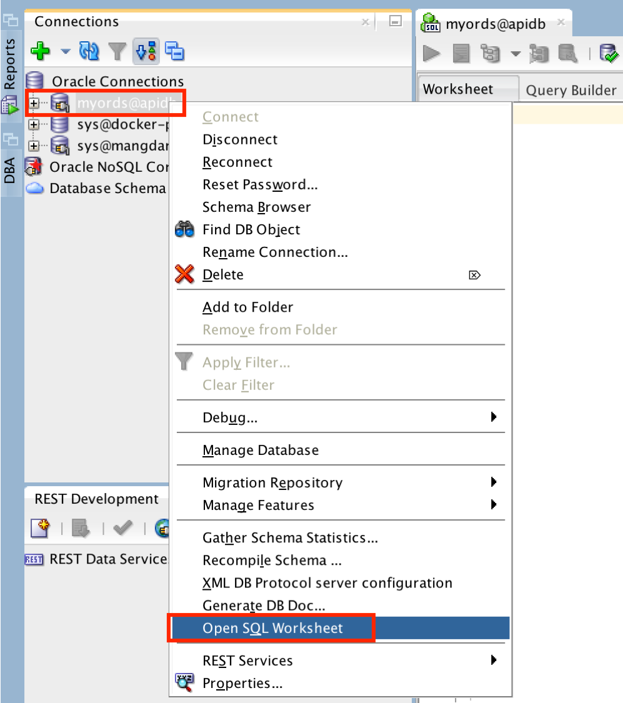

* * *

<details>
<summary>:point_right: (선택사항) Connection 생성이 안되어 있는 경우 (클릭)</summary>

> SQL Developer 좌측 상단의 + 버튼을 클릭하고 Connection을 생성 합니다.  
> 다음과 같이 입력하고, Connect 버튼을 클릭합니다.  
> ```
> Connection Name - myords#@apidb (# : 0 ~ 4)
> Username - myords# (# : 0 ~ 4)
> Password - Welcome123!!
> Hostname - 129.213.146.191
> Port - 1521
> SID - apidb
> ```
> 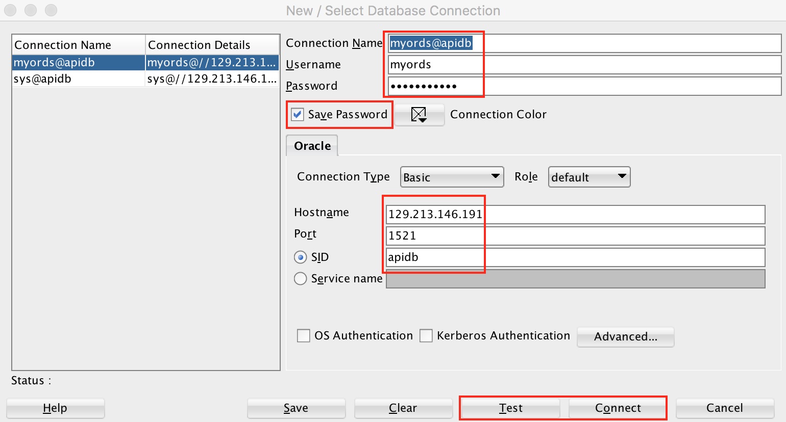
</details>

* * *

> Worksheet가 보이면 다음과 같이 쿼리를 입력하고 **Ctrl + Enter** 혹은 상단의 실행 버튼을 클릭합니다.  
> ```
> select id, title, release_date, runtime from movie;
> ```

> 조회된 Movie 테이블의 데이트를 확인할 수 있습니다.  
> 좌측의 REST Data Services 옆 + 버튼을 클릭하여 확장하면 Modules, Privileges, Roles 가 있습니다.  
> 

> **Modules**를 마우스 우 클릭하고 **New Module**을 선택합니다.  

> Module 설정 Wizard에서 다음과 같이 입력합니다.  
> 여러 사람이 같이 사용하는 DB이므로 Module은 설정이 안되어 있는 유니크한 값으로 입력합니다.
> ```
> Module Name - dankim1 (예시)
> URI Prefix - dankim1 (예시)
> Publish Make this RESTful Service available for use - Check
> ```
> 

> Next를 클릭하여 Template 설정을 합니다. 다음과 같이 입력합니다.
> ```
> URI Pattern : movie
> ```

> 설정한 URI Prefix, URI Pattern을 조합하여 ORDS에서 서비스되는 REST 서비스의 주소가 정해집니다.  
> 스키마 Alias는 사전에 설정이 되어 있으며, 스키마 이름과 동일합니다. (myords0 ~ myords4)
>```
> http://{ORDS서버주소}/{ORDS포트}/ords/{스키마Alias}/{Module_URI_Prefix}/{URI_Pattern}  
>```

> 

> Finish 버튼을 클릭하여 완료합니다.  
> 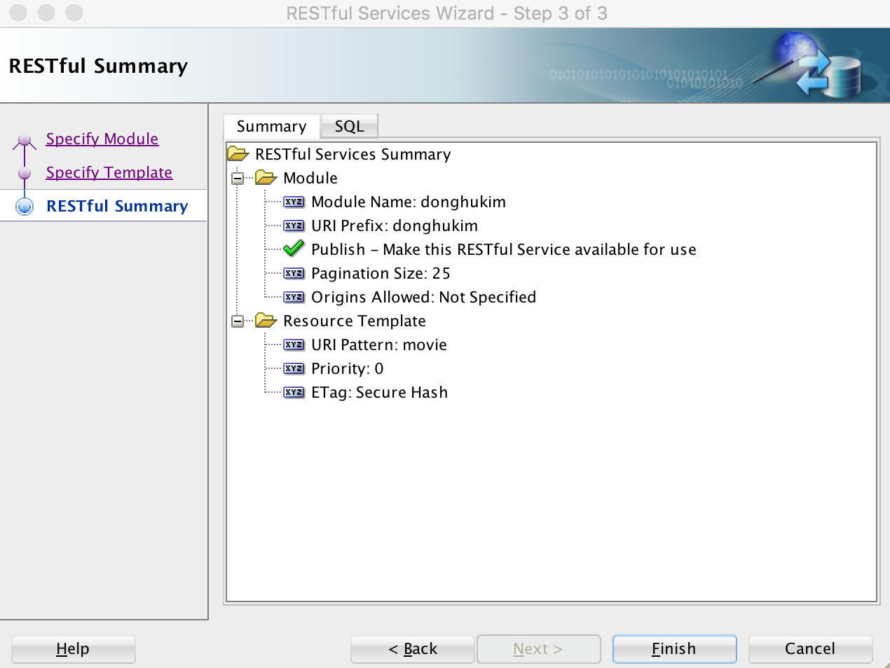

> 마지막으로 **Handler (Action)** 을 추가합니다.  
> 생성한 movie template을 클릭하고 마우스 우 클릭 후 **Add Handler > GET** 을 선택합니다.  
> 

> Apply를 선택합니다.  
> 

> 쿼리를 다음과 같이 입력하고 바로 위 저장 버튼을 클릭합니다.  
> :title은 쿼리 파라미터입니다.
>```
> select id, title, release_date, runtime from movie where upper(title) like '%' || upper(:title) || '%'
>```

> 브라우저에서 다음 URL로 접속해봅니다.  
> **module uri prefix**만 본인이 입력한 값으로 변경합니다.  
>```
> http://129.213.146.191:8080/ords/{myords#}/{module_uri_prefix}/movie
> http://129.213.146.191:8080/ords/{myords#}/{module_uri_prefix}/movie?title=toy
>```

> 다음과 같은 json 데이터가 보이면 성공입니다.  
> 간단하게 GET 방식의 REST API가 만들어 졌음을 확인할 수 있습니다.
> **위 서비스는 4.API Platform에서 등록할 때 사용되니, URL을 메모해 놓으시기 바랍니다.**
> 
</details>

#### 2. ORDS 서비스에 보안 및 정책을 적용하고 API Gateway에 배치하기
<details>
<summary>서비스 등록 및 API 정책 적용하기</summary>

> API Management Portal에 접속합니다. (사용자 계정 총 5개)
> 실수로 인한 계정 잠김 등을 고려하여 예비로 5개 계정을 만들어 두었습니다. 권한은 모두 동일하니 원하는 것을 선택하여 사용하세요.
>```
> Management Portal : https://apipcs-mangdan1.apiplatform.ocp.oraclecloud.com/apiplatform
> ID (PW) : 
> 1. awesome.api.world1@gmail.com / Welcome123!!
> 2. awesome.api.world2@gmail.com / Welcome123!!
> 3. awesome.api.world3@gmail.com / Welcome123!!
> 4. awesome.api.world4@gmail.com / Welcome123!!
> 5. awesome.api.world5@gmail.com / Welcome123!!
>```
> 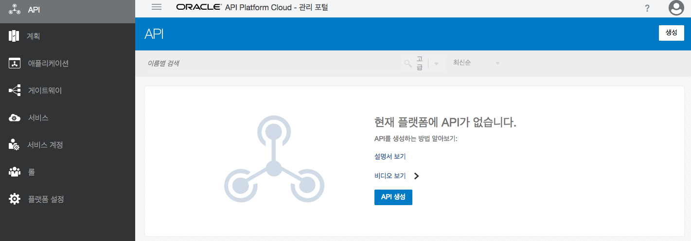

> 먼저 서비스를 등록합니다.  
> 서비스 메뉴를 클릭하고, 우측 상단 **생성** 버튼을 클릭합니다.  
> 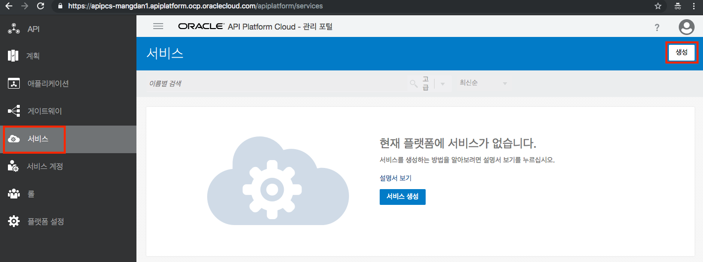

> 다음과 같이 입력하고 **생성** 버튼을 클릭합니다.  
> **하나의 실습용 API Platform 서비스을 모든 실습자가 사용하는 상황이므로, 이름이 겹치지 않게 다르게 주어야 합니다.**  
>```
> 이름 : My ORDS Service - "이니셜 혹은 유니크한 값" (e.g. My ORDS Service - Oracle) 
> 버전 : 1.0  
> 서비스 유형 : HTTP  
> 끝점 이름 : ORDS Movie Service  
> 끝점 URL (ORDS 실습에서 개발한 서비스 주소) : http://129.213.146.191:8080/ords/myords/{module_uri_prefix}/movie  
> 게이트웨이 노드 프록시 사용 - 체크  
>```
> 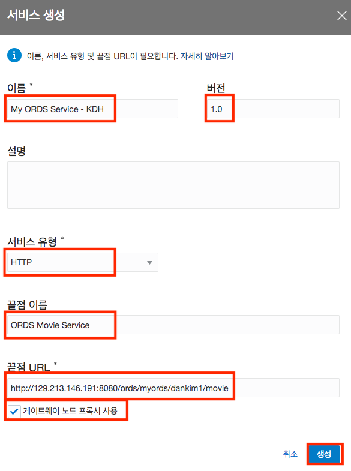

> API 메뉴를 클릭하고 **생성** 버튼을 클릭합니다.  
> 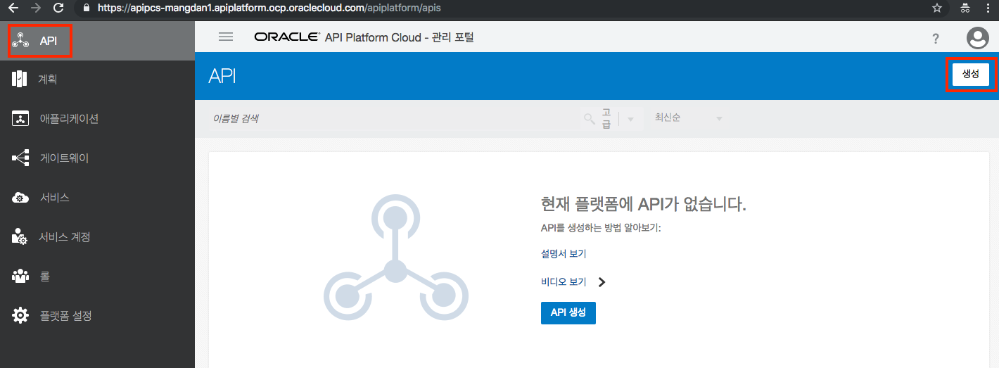

> 다음과 같이 입력하고 **생성** 버튼을 클릭합니다.  
> **하나의 실습용 API Platform 서비스을 모든 실습자가 사용하는 상황이므로, 이름이 겹치지 않게 다르게 주어야 합니다.**  
>```
> 이름 : Movie API - "이니셜 혹은 유니크한 값" (e.g. Movie API - Oracle)  
> 버전 : 1.0
>```
> 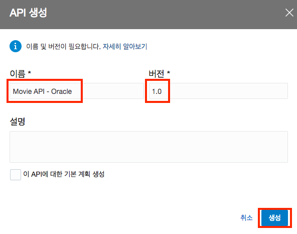

> 생성된 Movie API를 클릭하고 좌측 **API 구현** 아이콘을 클릭합니다.  
> API에 대한 수신할 엔드포인트, 호출할 대상서비스 지정, 보안 및 다양한 정책을 적용하는 부분입니다.  
> **API 요청** 클릭 후 우측 **편집** 버튼을 클릭합니다.  
> 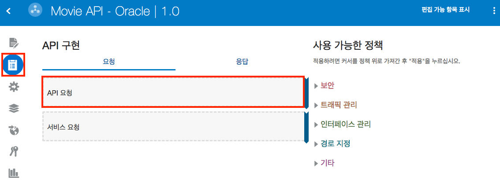

> API 요청에서는 노출할 Movie API에 대한 엔드포인트를 지정할 수 있습니다.  
> API 끝점 URL에 다음과 같이 입력하고 적용합니다.  
>```
> API 끝점 URL : movie_"이니셜 혹은 유니크한 값" (e.g. movie_oracle)
>```
> 

> 다음은 서비스를 지정하는 부분입니다. **서비스 요청**을 클릭하고 우측 편집 버튼을 클릭합니다.  
> **서비스 선택**을 클릭하고 앞서 등록한 서비스를 지정하고 적용합니다.  
> 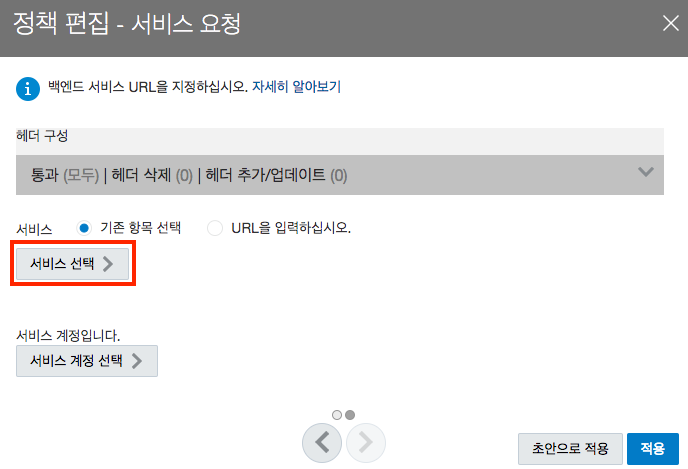  
> 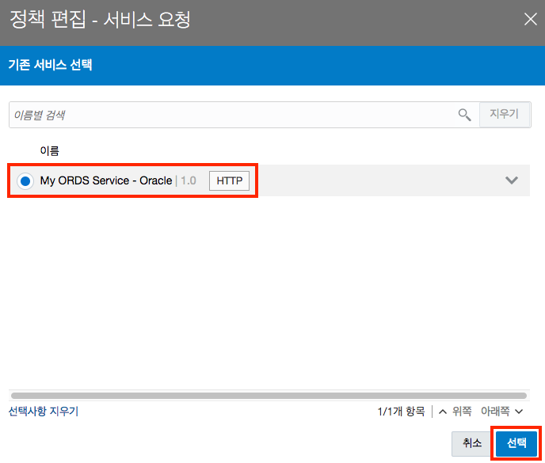  

> 다음과 같이 구성되었습니다.  
> 우측 상단의 **저장** 버튼을 클릭하여 저장합니다.  
> 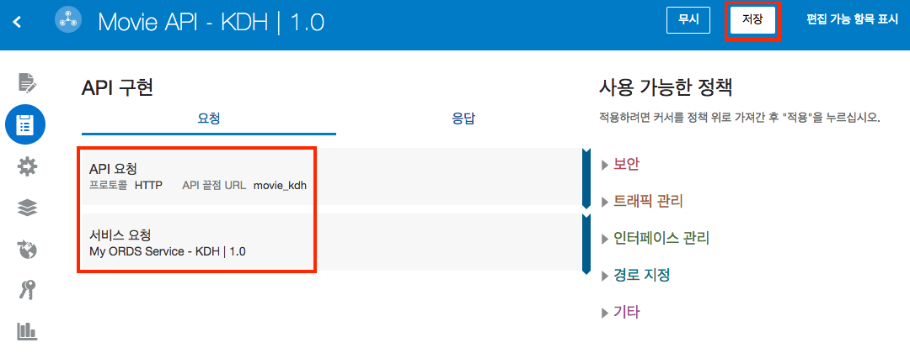  

> 이제 보안을 적용합니다.  
> 우측 **사용 가능한 정책** 부분에 **보안** 메뉴를 클릭하면, 여러가지 보안 정책을 볼 수 있습니다.  
> 여기서는 가장 기본인 **기본 인증(Basic Auth)** 을 적용합니다.  
> **기본 인증**을 클릭하고 **적용** 버튼을 클릭합니다.  
> 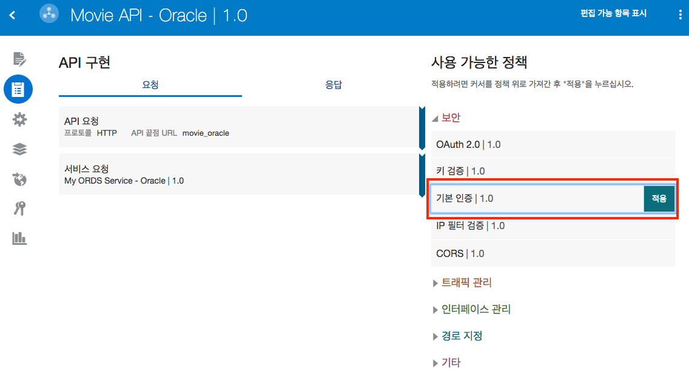  

> **API 요청** 다음에 정책이 실행되도록 선택하고, **다음** 아이콘을 클릭합니다.  
> 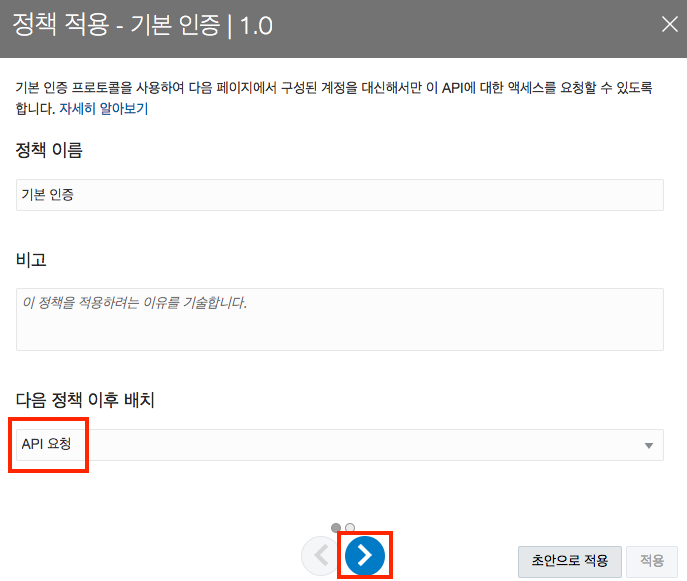  

> 탭 버튼중 **모든 사용자**를 선택하고 적용합니다.  
> 사용자 인증 정보를 활용하여 인증합니다.  
> 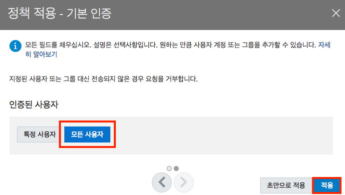  

> 이번엔 **트래픽 관리** 정책을 적용해보겠습니다.  
> 우측 정책 중 **트래픽 관리**의 **API 비율 제한** 정책을 클릭하고 **적용** 버튼을 클릭합니다.  
> 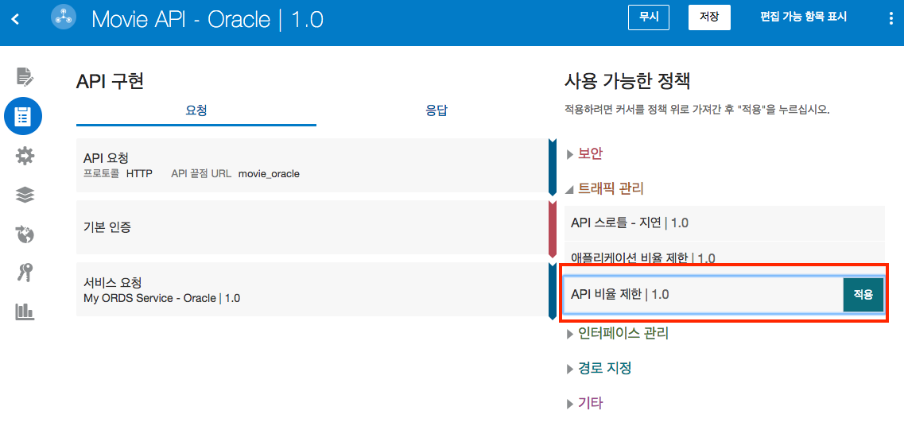  

> **API 비율 제한** 정책은 **기본 인증** 정책 이후에 실행되도록 선택하고 다음 아이콘을 클릭합니다.  
> 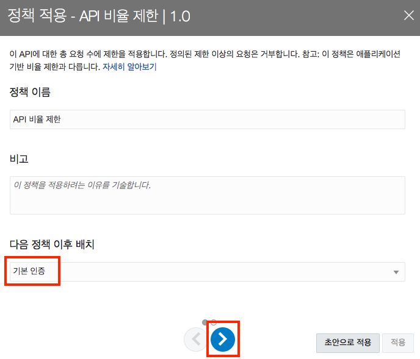  

> 하나의 **논리 게이트웨이**에서 1분 당 5건 이상 호출되지 못하도록 제한을 겁니다.  
> 다음과 같이 설정하고 **적용** 버튼을 클릭합니다.  
>```
> API 비율 제한 : 논리적 게이트웨이당
> API 비율 제한 : 5**
> 시간 간격 : 분
>```
> 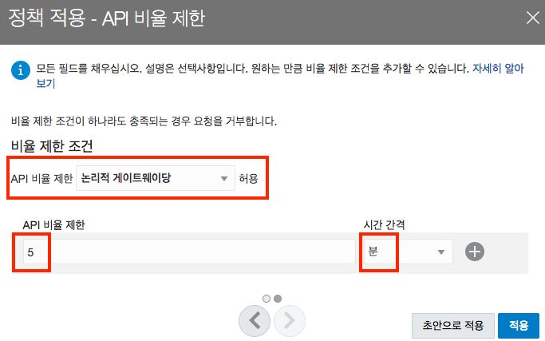  

> 우측 상단의 **저장** 버튼을 클릭하여 저장합니다.  
> 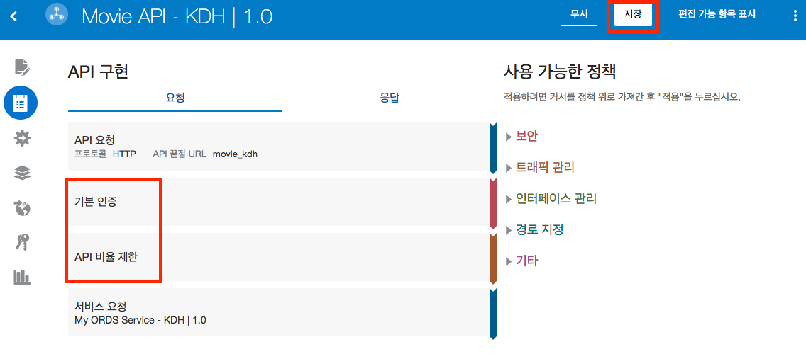  

> 이제 게이트웨이에 배치합니다. 좌측 **배치** 아이콘을 클릭하고 우측 상단의 **API 배치** 아이콘을 클릭합니다.  
> 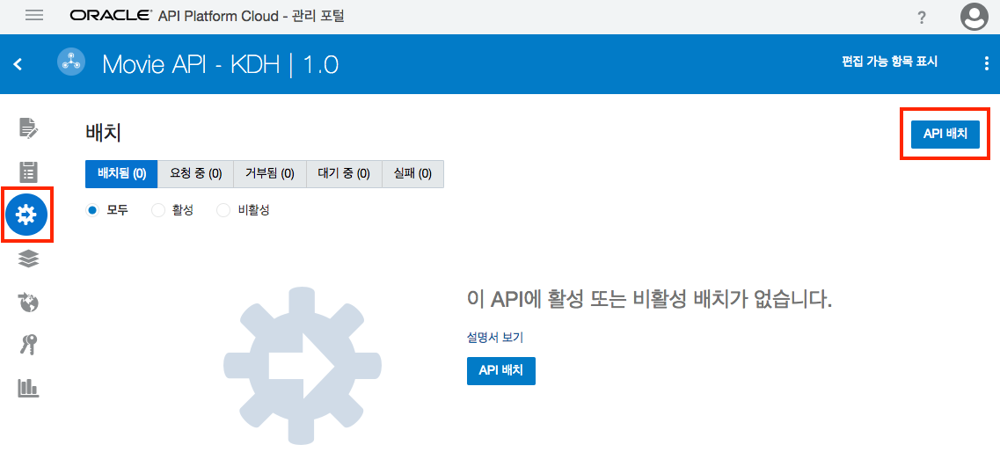  

> **OCI Production Gateway 1**를 제외한 **게이트웨이**는 샘플 게이트웨이로 [3세대 게이트웨이](#3rd-generation-gateway) 특징인  
> 다양한 환경(클라우드, On-Premise) 구성이 가능하다는 것을 보여주기 위한 예시로 만들었습니다. 실제 **물리적으로 게이트웨이 노드**가 구성되어 있지 않습니다.  
> 실습은 Oracle Compute Cloud에 구성되어 있는 **OCI Production Gateway 1**에만 배치합니다.  
> 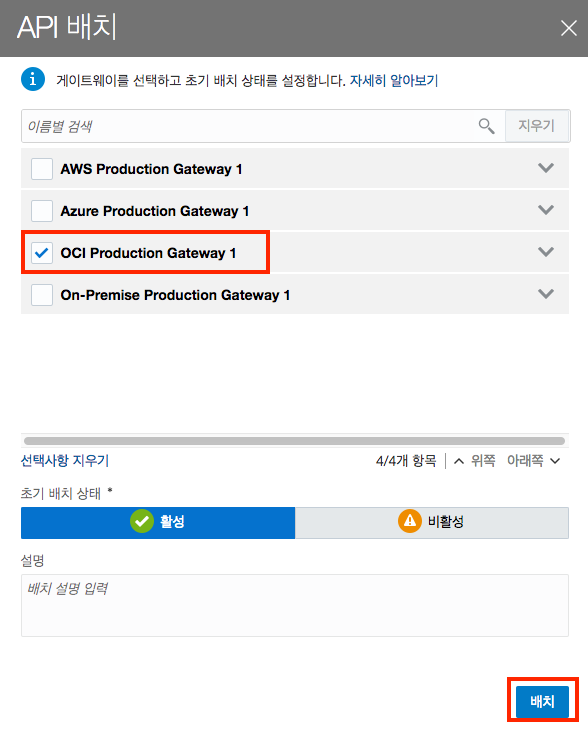  

> 대기 중(1) 상태에서 배치됨(1) 상태로 변경되면 배치가 완료된 것입니다.  
> Management Portal에서 설정된 정책은 각 게이트웨이에 지정된 폴링 타임에 맞춰 적용됩니다. 기본 폴링 타임은 2분 입니다.  
> 배치가 완료되면 다음과 같이 최종 API 엔드포인트 URL을 보실 수 있습니다. URL 복사 버튼을 클릭하여 URL을 복사 합니다.  
> 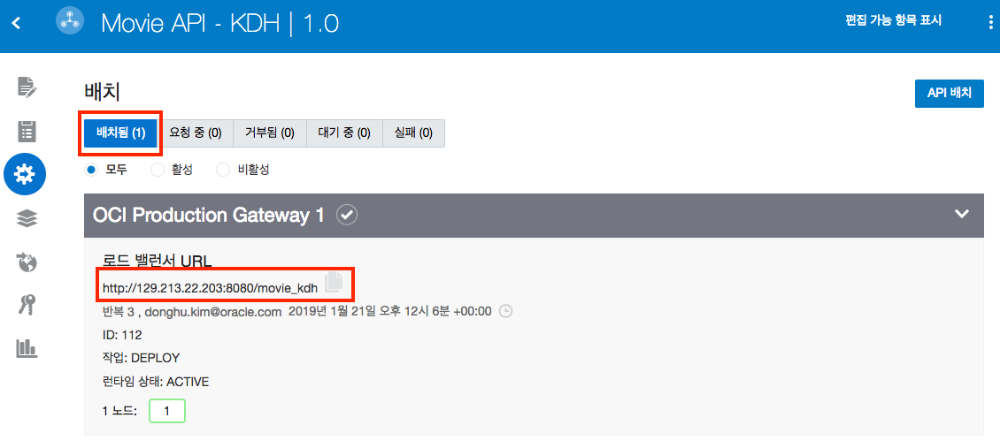  
</details>

<details>
<summary>배치된 서비스 테스트 하기</summary>

REST API Client 프로그램인 Insomnia를 활용하여 테스트를 진행합니다.  
> Insomnia를 실행하고 중앙 **New Request**를 실행합니다.  
> 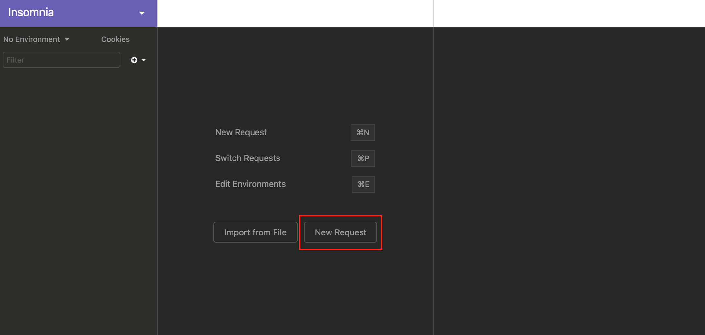 

> **Create** 버튼을 클릭합니다.  
> 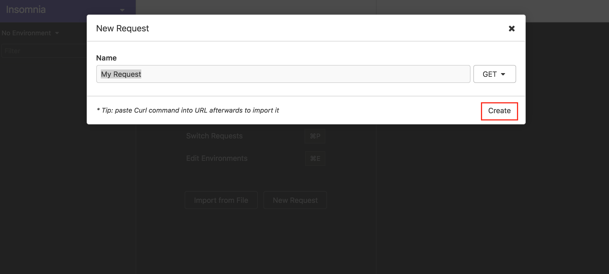  

> 상단에 복사한 Movie API의 엔드포인트를 입력하고 **Send** 버튼을 클릭합니다.  
> Basic Auth 정책이 적용되어 있어서 ***Invalid User*** 오류가 발생합니다.  
> 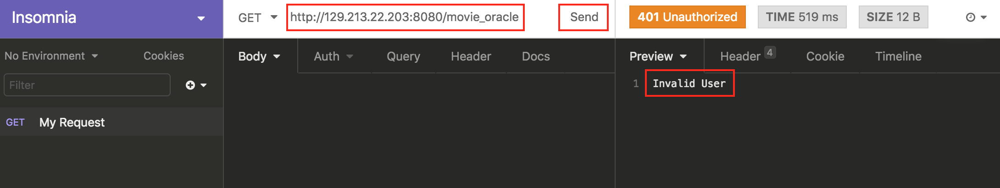  

> 상단 **Auth** 탭을 선택하고 **Basic Auth**를 선택합니다.  
> 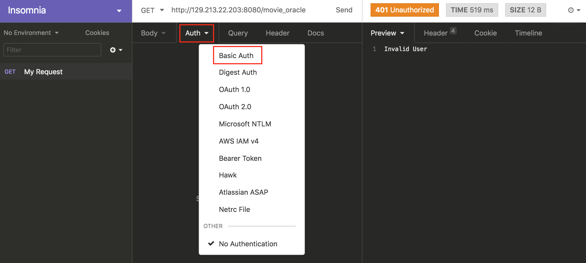  

> 상단 **Auth** 탭을 선택하고 **Basic Auth**를 선택합니다.  
> 다음과 같이 사용자 정보를 입력하고 **Send** 버튼을 클릭하여 응답 결과를 확인합니다.
> 아래 사용자는 테스트를 위해 Gateway에 사전에 등록해 놓은 사용자입니다.
>```
> USERNAME - weblogic
> PASSWORD - welcome1
>```
> 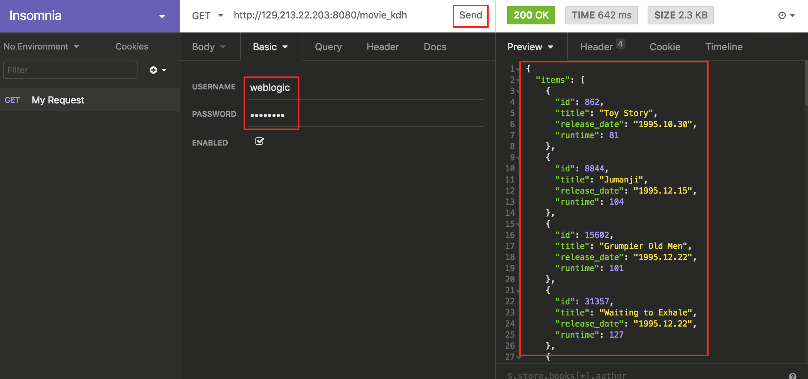  

> 다음은 트래픽 관리 정책 테스트입니다.  
> 분당 5건 이상 호출 시 제한이 걸리기 때문에, **Send** 버튼을 연속으로 5번 이상 클릭합니다.  
> 다음과 같이 **API Rate Limit has been reached** 오류가 발생한 것을 확인할 수 있습니다.
> 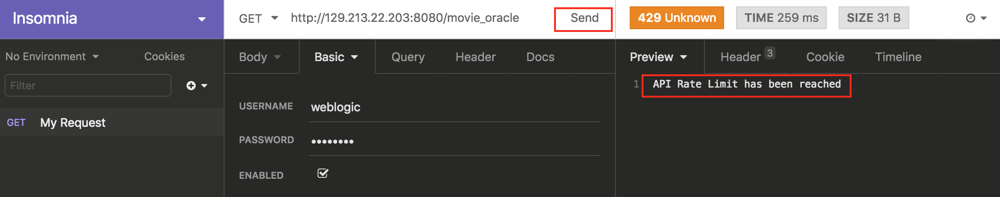  

</details>

#### 3. 애플리케이션 개발자를 위해 개발자 포탈에 API 퍼블리시 하기
<details>
<summary>(실습X) Apiary 연동 및 API 개발자 포탈에 게시</summary>

> API Platform에서 생성한 API를 클릭 후 **게시** 아이콘 클릭, **Apiary** 클릭
> 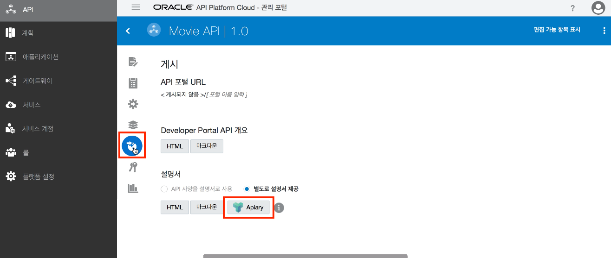  

> Apiry에 만든 문서 클릭 (Personal API는 지원하지 않습니다, Team API만 지원합니다.)  
> 참고 : [Apiary Team API and Personal API](#apiary-team-api-and-personal-api)
>   

> 저장하고 포탈에 등록합니다.  
> 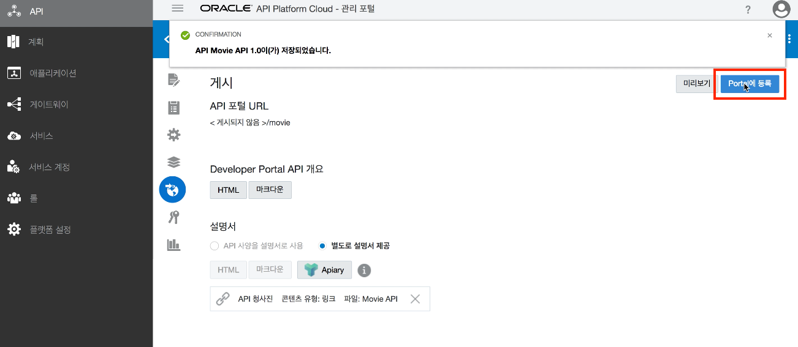  

> 포탈에 API를 퍼블리시가 완료되었습니다.  
> 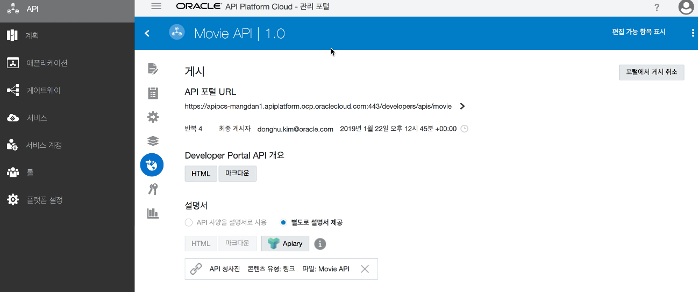  

</details>

<details>
<summary>개발자 포탈에서 API 검색 및 문서 보기</summary>
 
> API 개발자 포탈에 로그인 합니다.  
> 인증은 위에서 제공된 API Platform 관리자 계정을 사용합니다.  
>```
> https://apipcs-mangdan1.apiplatform.ocp.oraclecloud.com/developers
>```
> 애플리케이션 개발자가 애플리케이션을 등록하고, API 검색, 사용 요청등을 할 수 있는 공간입니다.  
> 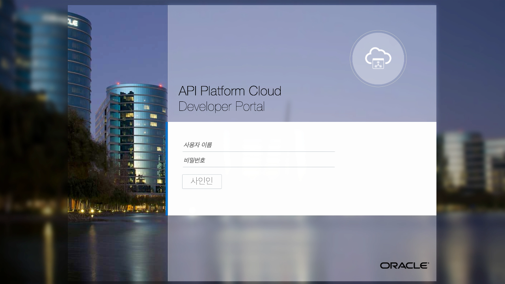 

> 게시된 Movie API를 확인할 수 있습니다.  
> 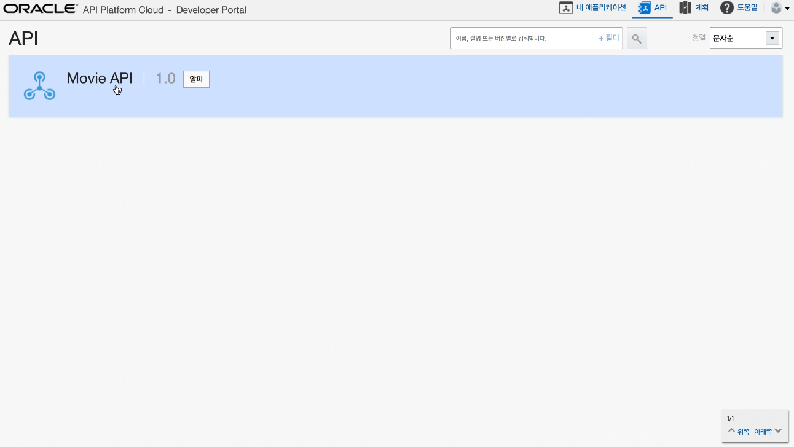 

> Movie API를 클릭하면, Apiary의 Movie API 문서를 확인할 수 있습니다.  
> 앱 개발자는 사용할 애플리케이션 정보를 등록하고, API 사용 요청 및 승인 과정등을 통해 사용할 수 있습니다.  
>  

</details>
<br>

- [홈으로 가기](README.md)
<br><br><br><br>

## 참고
#### 3rd Generation Gateway
> 서비스는 서비스 특성 혹은 비즈니스 목적에 따라 다양한 환경 (클라우드 혹은 On-premise)에서 운영될 수 있습니다.  
> 이러한 환경을 위해서는 게이트웨이 또한 서비스와 가장 근접한 위치에 구성이 가능해야 합니다.  
> 2세대 게이트웨이는 DMZ 밖으로 구성하기 어려웠지만, 3세대 게이트웨이는 마이크로 서비스 아키텍쳐를 지원하기 위해  
> 다양한 환경에 구성이 가능하도록 설계되었으며, 마이크로 게이트웨이 (Lightweight Gateway, e.g Grizzly)로써 빠른 확장이  
> 가능한 것이 특징입니다.  

#### Apiary Team API and Personal API
> Personal API는 무료 서비스로 개인만 작업이 가능하며, 팀단위 협업 기능은 지원하지 않습니다.  
> 또한 작성된 API 문서는 해당 문서의 URL만 알면 누구나 볼 수 있도록 공개됩니다.  
> 유료 서비스인 Enterprise 버전을 구매할 경우 팀 단위 협업이 가능한 Team API 문서를 생성할 수 있습니다.  
> Team API는 팀멤버를 구성하고 팀멤버만 볼 수 있는 Private API로 구성할 수 있습니다. 

</details>
