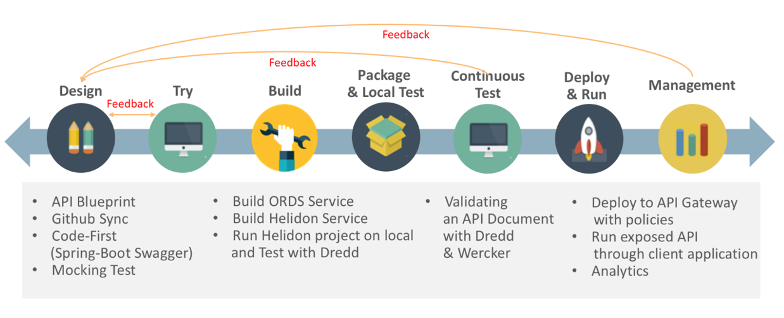
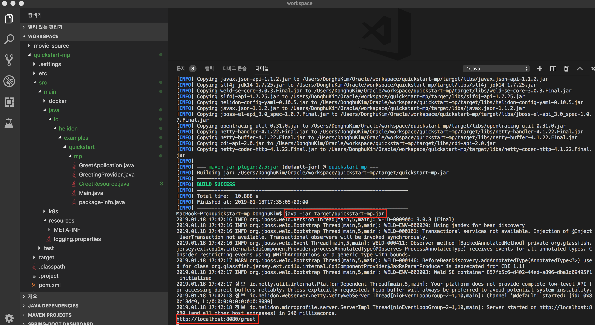
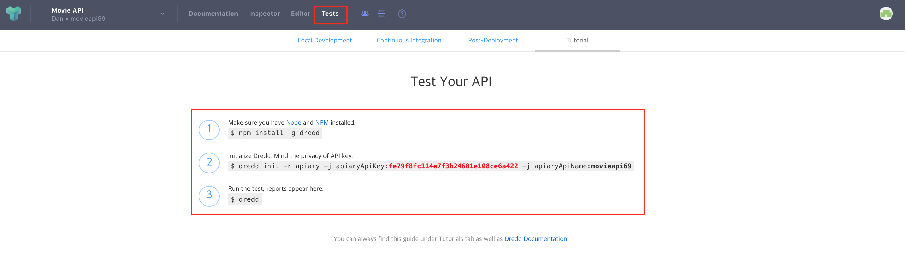
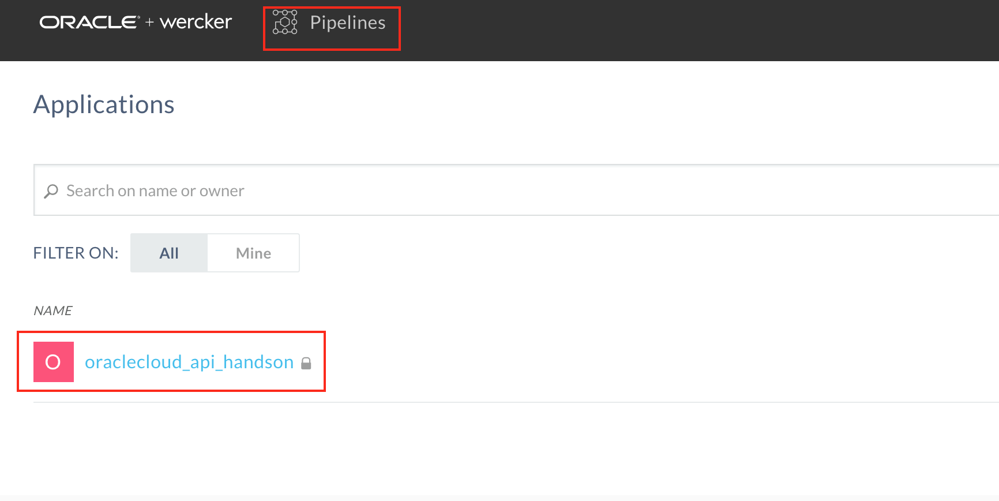

# 마이크로 서비스 개발을 위한 API 우선 설계 및 API 구축하기

본 문서는 Oracle Apiary에서 API Blueprint를 활용하여 API 문서를 만들고, 만들어진 문서를 토대로 [Oracle Helidon](http://helidon.io)과 [Oracle Database의 REST Data Service](https://www.oracle.com/database/technologies/appdev/rest.html)로 마이크로 서비스를 구현하는 것을 보여줍니다. 
또한 API 문서와 구현된 서비스간의 "동기화?" 비호환 (서비스에 대응하는 문서 호환 여부) 여부를 확인, 검증하는 [Dredd](https://github.com/apiaryio/dredd) 도구과 CI/CD 도구인 [Wercker](https://app.wercker.com/)를 통합하여 API 비호환 테스트를 지속적으로 자동화하는 것을 방법을 보여줍니다.
마지막으로 컨테이너에 배포된 API에 보안 및 다양한 정책을 적용해 보고, 최종적으로 API Gateway에 배포하여 서비스와 문서를 애플리케이션 개발자에게 오픈하는 내용을 담고 있습니다.
본 문서를 통해 오라클 솔루션을 활용하여 마이크로 서비스 개발에 대한 전반적인 라이프사이클을 경험해 볼 수 있습니다.

## 데스크탑 설치 프로그램
* [Java SE Development Kit 8](https://www.oracle.com/technetwork/java/javase/downloads/jdk8-downloads-2133151.html)
* [Node.js](https://nodejs.org/ko/download)
* [Apache Maven](https://maven.apache.org/download.cgi)
* [Git](https://git-scm.com/download/win)
* [Visual Studio Code](https://code.visualstudio.com/download)
* [SQL Developer](https://www.oracle.com/technetwork/developer-tools/sql-developer/downloads/index.html)
* [Insomnia](https://insomnia.rest/download)

## Oracle Cloud 환경
* [Oracle Apiary Cloud Service](https://apiary.io)
* [Oracle Compute Cloud Service](https://cloud.oracle.com/ko_KR/compute)
* [Oracle Database Cloud Service](https://cloud.oracle.com/ko_KR/database)
* [Oracle API Platform Cloud Service](https://cloud.oracle.com/ko_KR/api-platform)

## GitHub 계정
* [GitHub](https://github.com)

## 실습 내용
1. Apiary에서 API Blueprint 작성하기
2. Helidon (MP)과 ORDS를 사용하여 서비스 개발하고 Dredd를 사용하여 API Blueprint와 Helidon 서비스간  
   호환 여부 검증 및 테스트하기
3. Wercker와 Dredd, Github을 사용하여 지속적 통합 환경 구축하기
4. API 서비스에 보안 및 정책을 적용하고 API Gateway에 서비스 배포하기




## 1. API 설계 문서 작성하기
<details>
<summary>Apiary 계정 생성하기</summary>
API 설계 문서를 작성하고 Mock Test를 하기 위한 Apiary 계정을 생성하는 단계입니다.  
만약 계정을 가지고 있다면 이 단계를 건너뜁니다.  

> [Apiary(https://apiary.io)](https://apiary.io) 홈페이지에 접속한 후 우측 상단의 **Sign up** 버튼을 클릭합니다.  
> 

> **Continue with GitHub** 버튼을 클릭합니다.  
> 

> GitHub 계정을 입력하고 **Sign In** 버튼을 클릭합니다.  
> 

> Apiary에서 GitHub에 인증을 위한 권한을 요청합니다.  
> **Authorize apiaryio** 버튼을 클릭합니다.  
> 

> Apiary에서 사용할 이메일을 입력합니다.  
> GitHub 이메일을 입력합니다.  
> 

> Apiary 계정을 생성하면 기본 API 하나를 생성해야 합니다.  
> **Name your first API** 부분에 다음과 같이 *Movie API*를 입력하고 Blueprint를 선택합니다.  
> 

> Apiary 계정과 첫 API Blueprint 프로젝트를 성공적으로 생성하였습니다. :clap:  
> 생성을 하게 되면 좌측에 샘플 API Blueprint 마크다운과 에디터가 보이고, 우측에 HTML 문서가 보입니다.  
> 
</details>

<details>
<summary>API Blueprint 설계 문서 작성하기</summary>

이제부터 Movie API 문서를 작성합니다.  
> 아래의 API Blueprint를 복사해서 좌측 에디터의 내용을 지우고 붙여넣기 합니다.  
>```markdown
> FORMAT: 1A
> HOST: http://polls.apiblueprint.org/
> 
> # Movie API
> 
> 영화 정보를 제공하는 API 입니다.
> 
> ## Movies Collection [/movies]
> 
> ### List All Movies [GET]
> 
> + Response 200 (application/json)
> 
>         [
>             {
>                 "id": "19995",
>                 "title": "Avatar",
>                 "release_date": "2009.12.18",
>                 "runtime" : 100
>             },
>             {
>                 "id": "2699",
>                 "title": "Titanic",
>                 "release_date": "1997.12.19",
>                 "runtime" :194
>             }
>         ]
> 
> ### Get a Movie [GET /movies/{id}?{title}]
> 
> Movie ID와 Title로 조회하는 API 입니다.
> 
> + Parameters
>     - id : 2699 (string, required)
>     - title : Titanic (string, optional)
>     
> + Request
>     + Header
>             
>             Authorization : Basic AAA
> 
> + Response 200 (application/json)
>     + Attributes
>         - id : 2699
>         - title : Titanic
>         - release_date : 1997.12.19
>         - runtime : 194
>         - Include MovieDetail
>         - genres (array[Genres])
> 
> 
> 
> # Data Structure
> 
> ## MovieDetail (object)
> - overview : In the 22nd century, a paraplegic Marine is dispatched to the moon Pandora on a unique mission, but becomes torn between following orders and protecting an alien civilization.
> - status : Released
> - homepage : http://www.titanicmovie.com
> - vote_average : 7.2
> - vote_count : 12114
> 
> 
> ## Genres (object)
> - id : 18 (number, required)
> - name : Drama (string, required)
>```

> 우측의 자동 변환된 HTML문서를 확인하고, **List All Movies**와 **Get a Movie**를 클릭하여 내용을 확인합니다.  
> 우측 상단의 Save 버튼을 클릭하여 저장합니다.  
> 

:point_down: **아래 한번 읽어보세요.** - 작성된 API Blueprint에 대한 설명입니다.  
> 첫 번째 라인은 API Blueprint 버전 정도로 생각하면 됩니다.  
> 현재 API Blueprint spec은 1A revision 9 입니다.  
> ```markdown
> FORMAT: 1A
> ```
>
> 실제 서비스할 Production 서버의 주소입니다.  
> 처음에는 Production 환경이 없기 때문에 변경하지 않습니다.
> ```markdown
> HOST: http://polls.apiblueprint.org/
> ```
>
> API 문서 이름입니다. 한글도 가능합니다.
> ```markdown
> # Movie API
> ```
>
> API에 대한 설명, 소개를 적는 부분입니다.  
> ```markdown
> 영화 정보를 제공하는 API 입니다.
> ```
>
> API에 대한 엔드포인트 URL입니다.  
> ```markdown
> ## Movies Collection [/movies]
> ```
>
> API 엔드포인트에 대한 Action (Method)를 정의합니다.  
> ```markdown
> ### List All Movies [GET]
> ```
>
> 응답 JSON 샘플입니다.  
> ```markdown
>         [
>             {
>                 "id": 19995,
>                 "title": "Avatar",
>                 "release_date": "2009.12.18",
>                 "runtime" : 100
>             },
>             {
>                 "id": 2699,
>                 "title": "Titanic",
>                 "release_date": "1997.12.19",
>                 "runtime" :194
>             }
>         ]
> ```
>
> 두번 째는 파라미터를 받아서 조회하여 반환되는 Action입니다.  
> 다음과 같이 Path 파라미터(id)와 Query 파라미터(title) 정의합니다.  
> ```markdown
> ### Get a Movie [GET /movies/{id}?{title}]
>
> Movie ID와 Title로 조회하여 상세 Movie 정보를 반환합니다.
> ```
>
> 요청 파라미터 부분입니다. JSON 샘플이 아닌 [MSON](#mson) 방식을 사용합니다.
> ```markdown
> + Parameters
>     - id : 2699 (string, required)
>     - title : Titanic (string, optional)
>
> + Request
>     + Header
>
>             Authorization : Basic AAA
> ```
>
> 응답 파라미터 부분입니다. JSON 샘플이 아닌 [MSON](#mson) 방식을 사용합니다.
> ```markdown
> + Response 200 (application/json)
>     + Attributes
>         - id : 2699
>         - title : Titanic
>         - release_date : 1997.12.19,
>         - runtime : 194
>         - Include MovieDetail
>         - genres (array[Genres])
>
>
>
> # Data Structure
>
> ## MovieDetail (object)
> - overview : In the 22nd century, a paraplegic Marine is dispatched to the moon Pandora on a unique mission, but becomes torn between following orders and protecting an alien civilization. (string)
> - status : Released
> - homepage : http://www.titanicmovie.com
> - vote_average : 7.2
> - vote_count : 12114
>
>
> ## Genres (object)
> - id : 18 (number, required)
> - name : Drama (string, required)
> ```
>
> 위 데이터 정의 방식은 API Blueprint에서 지원하는 MSON 이라고 하는 데이터 정의 스펙입니다.  
> [참고 -> MSON (Markdown Syntax for Object Notation)](#mson)

</details>

<details>
<summary>API Blueprint GitHub에 푸시하기</summary>

작성된 API Blueprint 를 GitHub에 푸시해서 형상관리를 할 수 있습니다.
이 작업을 위해서는 Apiary와 GitHub Sync가 되어야 하는데, 이 과정을 보여줍니다.

> 먼저 GitHub에 Repository를 하나 생성합니다.   
> GitHub에 로그인한 후 New repository를 클릭합니다.  
> 

> Repository 이름을 입력합니다. 여기서는 *oraclecloud_api_handson* 이라는 이름으로 생성합니다.  
> 

> 맨 아래 Import code를 클릭합니다.  
> 본 과정에서 사용되는 소스와 설정파일을 포함한 Repository를 복제하면서 생성합니다.  
> 

> clone URL에 ***https://github.com/mangdan/oraclecloud_api_handson*** 을 입력하고, Begin Import를 클릭합니다.  
> 

> GitHub Repository가 생성되었습니다. Repository 링크를 클릭하면 Repository와 Import한 파일들을 확인 할 수 있습니다.  
> 

> 이제 Apiary 상단의 사람 모양 아이콘 옆 Settings 아이콘을 클릭합니다.  
> 이 Settings 는 작성한 문서에 대한 설정을 하기 위한 설정 버튼입니다.  
> 

> 맨 하단 *Link your GitHub account* 버튼을 클릭합니다.  
> 

> 맨 하단 *List all repositories* 버튼을 클릭합니다.  
> 

> *Authorize apairyio* 버튼을 클릭합니다.  
> 

> 다시 하단의 *Link your GitHub account* 버튼을 클릭하면 다음과 같이 생성한 repository를 선택할 수 있습니다.  
> 옆의 Connect 버튼을 클릭합니다.  
> 
 
> *Commit and start sync* 버튼을 클릭합니다.  
> 

> 작성한 API Blueprint문서와 GitHub Repository가 싱크되었습니다.  
> 

> 다시 상단의 Editor 버튼을 클릭하면 우측 **Save** 버튼 옆에 **Push** 버튼이 생성 된 것을 확인하실 수 있습니다.  
> 이제 문서를 변경하면 변경이 되었다는 알림(빨간점)이 Push 버튼에 나타나며, Push 버튼을 클릭하여 GitHub에 바로 푸시할 수 있습니다.  
> 

> GitHub Repository에는 apiary.apib 파일이 생성됩니다.  
> GitHub에 생성된 파일을 클릭하여 내용을 확인합니다.  
> 
</details>

## 2. API 서비스 개발하기
<details>
<summary>Helidon MP (MicroProfile) 프로젝트 생성 및 서비스 개발하기</summary>

> 작업은 Visual Studio Code를 통해서 진행합니다.  
> Visual Studio Code를 실행하고 Visual Studio Code 상단 터미널을 클릭하고 새 터미널을 오픈합니다.  
> 다음과 같이 Maven Path와 Java Home 환경 변수를 체크합니다.
> ```
> mvn -version
> echo %JAVA_HOME%
> ```
> 

<details>
<summary>&nbsp;&nbsp;&nbsp;&nbsp;:point_right: Maven Path와 Java Home 변수 설정 안되어 있을 경우 (클릭)</summary>

> Maven Path와 Java Home 설정이 안되어 있을 경우 Windows Command 창을 열고 다음과 같이 실행합니다.  
> 아래 Maven과 JDK는 자신의 PC 설치 위치를 확인하고 설정하여야 합니다.
> ```
> setx path "%PATH%;c:\Oracle\apache-maven-3.6.0\bin"
> setx JAVA_HOME "c:\Program Files\Java\jdk1.8.0_202"
> ```
</details><br>

> 여기서는 MicroProfile 기반 Helidon 프로젝트를 생성합니다. [참고 -> Helidon](#helidon)
> c:\Oracle\workspace 폴더로 이동 후 Helidon Template Project 생성을 위해 mvn generate를 실행합니다.
> ```
> cd c:\Oracle\workspace
> 
> mvn archetype:generate -DinteractiveMode=false -DarchetypeGroupId=io.helidon.archetypes -DarchetypeArtifactId=helidon-quickstart-mp -DarchetypeVersion=0.11.0 -DgroupId=io.helidon.examples -DartifactId=quickstart-mp -Dpackage=io.helidon.examples.quickstart.mp
> ```

> 관련된 라이브러리와 메이븐 플러그인을 다운로드 받습니다.  
> 다운로드가 완료되면 다음과 같이 Build Success 화면을 볼 수 있습니다.  
> 

> 좌측 상단 버튼 클릭 후 **폴더 열기** 버튼 클릭 후 c:\Oracle\workspace 폴더를 선택, 열기를 선택합니다.
> 

> 기본 Helidon MP Project Structure 입니다.  
> 

> Visual Studio Code 터미널에서 생성한 프로젝트 폴더로 이동 후 다음과 같이 Packaging을 합니다.  
> :large_orange_diamond: 명령어 실행은 생성한 Helidon 프로젝트 폴더 안에서 실행합니다.
>```
> cd quickstart-mp
> mvn package
>```

> 완료되면 다음과 같이 실행합니다.  
> :large_orange_diamond: 명령어 실행은 생성한 Helidon 프로젝트 폴더 안에서 실행합니다.
>```
> java -jar target/quickstart-mp.jar
>```
> 

> 다음과 같이 브라우저로 접속해봅니다.
>```
> http://localhost:8080/greet
>```
> 

> VS Code 터미널에서 Ctrl + C로 실행중인 프로세스를 종료합니다.  
> 다음과 같이 처음 생성한 본인의 깃헙 계정에서 관련된 소스를 로컬로 Clone합니다.  
>```
> git clone https://github.com/{깃헙계정명}/oraclecloud_api_handson c:\Oracle\oraclecloud_api_handson
>```

> Helidon 프로젝트에 movie api 소스를 복사합니다.  
>```
> cp c:\Oracle\oraclecloud_api_handson\movie_api\movie*.json c:\Oracle\workspace\quickstart-mp\src\main\resources
> cp c:\Oracle\oraclecloud_api_handson\movie_api\*.java c:\Oracle\workspace\quickstart-mp\src/main/java/io/helidon/examples/quickstart/mp
>```
> 

> 다시 Packaging 및 실행합니다.   
> :large_orange_diamond: 명령어 실행은 생성한 Helidon 프로젝트 폴더 안에서 실행합니다.
>```
> mvn package
>
> java -jar target/quickstart-mp.jar
>```
> 

> 다음과 같이 브라우저로 접속해봅니다.
>```
> http://localhost:8080/movie
>
> http://localhost:8080/movie/titanic
>```
> 
> 
</details>

<details>
<summary>ORDS를 활용하여 REST 서비스 만들기</summary>
   
> SQL Developer를 실행합니다.  
> 좌측에 생성된 Connection (ords@apidb)을 마우스 우클릭 해서 ***Open SQL Worksheet*** 를 선택합니다.  
<그림 추가>

<details>
<summary>&nbsp;&nbsp;&nbsp;&nbsp;:point_right: Connection 생성이 안되어 있는 경우 (클릭)</summary>
   
> SQL Developer 좌측 상단의 + 버튼을 클릭하고 Connection을 생성 합니다.  
> 다음과 같이 입력하고, Connect 버튼을 클릭합니다.  
> ```
> Connection Name - ords@ordsdb
> Username - ords
> Password - Welcome123!
> Hostname - ip (todo)
> Port - 1521
> SID - ordsdb
> ```
> <그림 추가>
</details><br>

> Worksheet가 보이면 다음과 같이 쿼리를 입력하고 **Ctrl + Enter** 를 입력합니다.  
> ```
> SELECT * FROM MOVIE;
> ```

> 조회된 Movie 테이블의 데이트를 확인할 수 있습니다.  
> 좌측의 REST Data Services 옆 + 버튼을 클릭하여 확장하면 Modules, Privileges, Roles 가 있습니다.  
> 

> **Modules**를 마우스 우 클릭하고 **New Module**을 선택합니다.  
> 여기선 Module과 Template이라는 것을 설정합니다.  
> Module의 URI Prefix와 Template의 URI Pattern이라는 것을 순서대로 입력할 것입니다.  
> 입력하게 되면 실제 REST 서비스의 주소는 다음과 같이 생성됩니다.   
> http://{ORDS서버주소}/{ORDS포트}/ords/{스키마Alias}/{Module_URI_Prefix}/{URI_Pattern}  
> 현재 실습을 위해 구성되어 있는 DB Cloud 스키마의 Alias는 **myords** 입니다.  

> Module에서는 다음과 같이 입력합니다.  
> 여러 사람이 같이 사용하는 DB이므로 Module은 영문이름과 같이 유니크한 값으로 입력합니다.
> ```
> Module Name - 본인이름 영문명 (e.g dankim)
> URI Prefix - 본인이름 영문명 (e.g dankim)
> Publish Make this RESTful Service available for use - Check
> ```
> 

> Next를 클릭하여 Template 설정을 합니다. 다음과 같이 입력합니다.
> ```
> URI Pattern : movie
> ```
> 

> Finish 버튼을 클릭하여 완료합니다.  
> 

> 마지막으로 Handler (Action)을 추가합니다.  
> 생성한 movie template을 클릭하고 마우스 우 클릭 후 Add Handler > GET 을 선택합니다.  
> 

> Apply를 선택합니다.
> 

> 쿼리를 다음과 같이 입력하고 바로 위 저장 버튼을 클릭합니다.
>```
> select id, title, release_date, runtime from movie
>```

> 브라우저에서 다음과 같은 URL로 접속합니다. module uri prefix만 본인이 입력한 값으로 변경합니다.  
>```
> http://129.213.146.191:8080/ords/myords/dankim/movie
>```
> 다음과 같은 json 데이터가 나오면 성공입니다.
> 
</details>

<details>
<summary>Dredd를 활용하여 API 문서와 API간의 호환 여부 검증하기</summary>

> Dredd([참고 -> Dredd](#dredd))는 Apiary에서 주도하는 오픈소스이며, API 문서와 구현된 서비스간 일치 여부 검증을 테스트하는 도구입니다.  
> 현재 API Blueprint와 Swagger를 지원합니다.  

> Apiary의 Test 탭을 클릭하면 Dredd에 대한 사용방법과 초기 설정을 위한 가이드를 볼 수 있습니다.  
> Apiary에 접속해서 Movie API 상단 **Tests**을 클릭합니다.  
> 두 번째 Dredd init 부분을 보면 apiaryApiKey와 apiaryApiName를 볼 수 있는데,  
> Dredd와 Apiary가 통신하기 위해 필요한 부분으로 사용자와 문서별로 상이합니다.
> 

> Visual Studio Code의 터미널 환경에서 Dredd Install 작업을 수행합니다.  
> 작업 위치는 Helidon Project (quickstart-mp) 입니다.  
>```
> cd c:\Oracle\workspace\quickstart-mp
>
> npm install -g dredd
>```
> 

> dredd init 작업 수행 시 필요한 apiaryApiKey와 apiaryApiName은 API 문서마다 상이하니 아래 내용을 그대로  
> 복사하지 말고, 꼭 Tests 를 클릭해서 각자의 apiaryApiKey와 apiaryApiName를 확인하고 실행합니다.  
> 굵은 글씨 부분을 따라서 입력합니다.  
> 참고로 apiary.apid는 API Blueprint 문서로 Apiary GitHub Sync 실습을 통해서 푸시한 파일을 Clone 한 파일입니다.
> <pre><code>dredd init -r apiary -j apiaryApiKey:<B>fe79f8fc114e7f3b24681e108ce6a422</B> -j <B>apiaryApiName:movieapi69</B>
> 
> ? Location of the API description document <B>../../oraclecloud_api_handson/apiary.apib</B>
> ? Command to start the API server under test <B>java -jar target/quickstart-mp.jar</B>
> ? Host of the API under test <B>http://localhost:8080</B>
> ? Do you want to use hooks to customize Dredd's behavior? <B>Y</B>
> ? Programming language of the hooks <B>JavaScript</B>
> ? Found Travis CI configuration, do you want to add Dredd? <B>N</B>
> </pre></code>
> 

> dredd.yml 파일이 생성되었습니다. dredd 명령어를 실행합니다.  
>```
> dredd
>```
> 

> Apiary Tests 로 다시 들어가보면 테스트 결과 리포트를 볼 수 있습니다.
> 
</details>


## 3. Continuous Integration 환경 구성하기
<details>
<summary>Wercker 계정 생성하기</summary>

> Wercker는 컨테이너 기반의 CI/CD 도구입니다. Dredd로 로컬에서 간단히 테스트를 할 수 있지만,  
> Wercker와 GitHub을 활용하여 지속적으로 검증 및 테스트를 수행할 수 있습니다.  
> GitHub 계정을 활용하여 Wercker 계정을 생성합니다. 상단의 **Sign Up** 버튼을 클릭합니다.
> 

> **SIGN UP USING GITHUB** 버튼을 클릭하고 GitHub 아이디와 패스워드를 입력합니다.
> 

> **Authorize wercker** 버튼을 클릭합니다.
> 

> Name, Email을 입력하고 **FINISH UP** 버튼을 클릭합니다.
> 

> **Create your first application** 버튼을 클릭합니다.  
> 혹은 우측 상단의 + 버튼을 클릭하고, Add Application을 선택합니다.
> 

> 다음과 같이 SCM을 GitHub으로 선택하고 Next 버튼을 클릭합니다.
> 

> GitHub Repository를 선택합니다.
> 

> **Wercker will check out the code without using an SSH key** 선택합니다.
> 

> **Create** 버튼을 클릭하여 Wercker Application을 생성합니다.  
> 혹은 우측 상단의 + 버튼을 클릭하고 Add Application을 선택합니다.
> 

> Wercker Application을 성공적으로 생성하였습니다.
> 

> 맨 아래 **trigger a build now** 버튼을 클릭하면 빌드가 시작됩니다.
> 

> 상단 **wercker_pipeline** 버튼을 클릭하면 Wercker Application이 보입니다.  
> Application을 클릭합니다.
> 

> 구성한 Wercker Application에 의해 빌드가 진행된 내역을 볼 수 있습니다. 
> 
</details>

<details>
<summary>Continuous Integration 테스트</summary>
   
> 처음 GitHub Repository를 생성할 때 따로 제공해드린 GitHub Repository를 Import한 것을 기억하실 겁니다.  
> Wercker와 Helidon 소스, 기타 관련 설정 파일들이 포함되어 있으며, Wercker는 wercker.yml 파일에 기술된  
> 스탭과 파이프라인을 실행합니다. ([참고 -> Wercker Config])(#wercker-config) 
> 

> 첫 번째 빌드에서는 오류는 발생하지 않았지만, dredd.yml 파일에 기술되어야 하는 apiaryApiKey와 apiaryApiName이  
> 없어서 Apiary로 테스트 결과 데이트가 전송되지 않습니다.  
> Apiary의 상단 Tests 링크를 클릭하고 dredd init 라인에 있는 apiaryApiKey와 apiaryApiName을 복사합니다.  
> 

> GitHub Repository로 가서 dredd.yml파일을 클릭하고 우측 상단의 연필 아이콘을 클릭합니다.
> 

> 다음과 같이 수정하고 하단 **Commit Changes** 버튼을 클릭하여 커밋합니다.
> 

> Wercker에서 Build가 시작된 것을 확인할 수 있습니다.
> 

> Wercker에서 Build 및 Test가 오류 없이 완료되었습니다.
> 

> Apiary의 Tests로 들어가서 **Continuous Integration**을 클릭하면 다음과 같이 결과 리포트를 확인할 수 있습니다.  
> 

> API Blueprint 문서와 API 소스가 변경이 일어나면 Wercker에 의해서 자동으로 문서 호환 여부를 체크하여 결과를  
> 다양한 채널 (Apiary, 이메일, Slack 등)로 전송해줍니다.  
> Wercker가 CI/CD 솔루션이므로 모든 테스트를 마친 API는 최종적으로는 다양한 운영 환경에 자동 배포가 될 수 있습니다.

</details>

## 4. API에 보안 및 정책 적용 후 게이트웨이에 배포하기
<details>
<summary>서비스 등록 및 API 정책 적용하기</summary>

> 다음은 현재 Oracle Compute Cloud에 배포되어 있는 Helidon API 서비스 입니다.  
> 여러분들이 만든 Helidon API 소스와 동일한 소스가 아래 10개의 Docker Container에 배포되어 있습니다.  
> 아래 배포된 서비스들 중 하나를 선택해서 실습을 진행합니다.  
...............  
...............  
...............  
...............  
...............  
...............  
> API Platform에 접속합니다.
> 서비스를 등록합니다.
> API를 등록하고 정책과 보안을 적용합니다.
> 게이트웨이에 배포합니다.
</details>

<details>
<summary>배포된 서비스 테스트 하기</summary>
   
> Insommnia를 실행하여 게이트웨이에 배포된 서비스 테스트를 합니다.
</details>

## 5. 애플리케이션 개발자를 위해 개발자 포탈에 퍼블리시 하기
<details>
<summary>Continuous Integration 테스트</summary>

> Apiary 와 연동 후 개발자 포탈에 퍼블리시 합니다. (내 계정으로, 혹은 이 부분은 문서로만...)
> 개발자 포탈에 접속하여 API와 문서를 확인합니다.
> 끝~~~~
</details>
<br><br><br><br>

## 참고
#### Helidon
> [Helidon](https://helidon.io)은 오라클이 만든 마이크로 서비스 개발 프레임웍입니다.  
> Eclipse Microprofile 스펙을 구현한 [Helidon MP](https://helidon.io/docs/latest/#/guides/02_MP_REST_web-service)와 최신 React 개발 방식을 지원하는  
> Microframework인 [Helidon SE](https://helidon.io/docs/latest/#/guides/01_SE_REST_web-service)를 제공합니다. 
> 또한 Docker Image 생성을 위한 Dockerfile과 Kubernetes 배포 파일 (app.yaml)을 기본 제공합니다.  

#### Apiary에서 Personal API와 Team API
> Personal API는 무료 서비스로 개인만 작업이 가능하며, 팀단위 협업 기능은 지원하지 않습니다.  
> 또한 작성된 API 문서는 해당 문서의 URL만 알면 누구나 볼 수 있도록 공개됩니다.  
> 유료 서비스인 Enterprise 버전을 구매할 경우 팀 단위 협업이 가능한 Team API 문서를 생성할 수 있습니다.  
> Team API는 팀멤버를 구성하고 팀멤버만 볼 수 있는 Private API로 구성할 수 있습니다. 

#### API Blueprint와 Swagger
> API Blueprint와 Swagger는 API 문서 작성 시 가장 많이 사용되고 있는 API 문서 정의 언어입니다.  
> 이외에 MuleSoft의 RAML(YAML)과 Slate(Markdown), Asciidoc (Spring-boot REST Doc 에서 기본으로 사용)  
> 등이 있습니다. API Blueprint의 경우 API 문서를 생성하는데 포커스가 맞쳐져 있습니다. 반면에 Swagger는 API를  
> 정의하는데 포커스가 맞춰져 있다고 볼 수 있습니다. API Blueprint는 개발자가 아니어도 쉽게 배울 수 있으며, 작성하기  
> 쉽고 이해하기 쉬운 마크다운 형식을 지원합니다.  
> 문서를 위한 스펙이기 때문에 실제 구현을 위한 정의가 Swagger에 비해 상대적으로 많이 포함되지 않아, 스텁이나 스니펫과  
> 같은 코드 생성 기능을 제공하기 어렵습니다. Swagger는 Linux Foundation의 오픈소스 프로젝트인 OpenAPI  
> Initiative에 추가되면서 현재는 Open API Specification (OAS) 이라는 이름으로 불리고 있습니다.  
> 개발자에게 친숙한 JSON, YAML 형식으로 작성하며, 구현을 위한 여러가지 스펙을 포함하고 있기 때문에 개발자 사이에서 많이  
> 사용되고 있으며, 다양한 언어의 스텁 코드를 생성할 수 있는 기능도 제공될 수 있습니다. (e.g. Swagger Codegen)  
> 반면에 API Blueprint에 비해서 구현에 관련된 많은 내용이 포함되기 때문에 비 개발자에게는 다소 복잡하게 느껴질 수 있습니다.  
> Swagger는 상대적으로 문서의 복잡성이 높아서 문서를 먼저 만들고 API를 만들기 보다는 이미 만들어진 API에서 Swagger문서를  
> 추출하는 방식으로 더 많이 사용됩니다. (ORDS를 포함 많은 개발 언어 및 프레임웍에서 Swagger 생성 기능을 제공합니다.)  
> 일반적으로 Design First 를 말할때는 API Blueprint, Code First를 말할때는 Swagger를 떠올리면 됩니다.  
> (물론 Swagger가 더 익숙한 사용자라면 Swagger가 Design First Approach가 될 수 있습니다.)  

#### MSON
> 두번 째 API Action에 대한 요청/응답 데이터를 작성할 때 JSON 형태의 데이터가 아니어서 의아했을텐데요.  
> 하지만 Apiary 우측의 HTML 문서에서는 JSON으로 변환되어 보이는 것을 확인 할 수 있을 겁니다.
> 이 데이터 정의 방식은 API Blueprint의 또하나의 데이터 정의 방식인 [MSON](https://apiblueprint.org/documentation/mson/specification.html) (Markdown Syntax for Object  
> Notation) 이라는 스펙으로 JSON보다 간결한 방식으로 데이터를 작성할 수 있게 도와주는 스펙입니다.  
> 비 개발자의 경우 JSON에 익숙하지 않은 경우가 많은데, 이 경우 MSON을 사용하면 좀 더 쉽게 문서 작성이 가능합니다.  
> 또한 변환된 HTML 문서에서는 JSON으로 변환되어 제공되기 때문에 개발자는 필요한 JSON 형태로 데이터를 확인할 수 있습니다. 
> MSON으로 문서를 작성하면서, 우측의 HTML 문서를 보면 JSON으로 실시간 변환되는 것을 확인할 수 있습니다.
> 기본적인 사용법은 다음과 같습니다.  
>>```
>> +Parameters or +Attributes  
>>   - id : 1001 - 아이디입니다. (number, required)   
>> 
>>   Request일 경우 +Parameters, Response일 경우 +Attributes를 입력하고, 하위에 포함할 항목을 입력합니다.
>>   항목은 - 혹은 +로 시작합니다. 여기서는 키 값인 id를 제외하고 나머지는 옵셔널입니다.  
>>   "id"는 키 값, "1001"은 샘플 값, "아이디"는 설명, "number"는 값 유형, "required"는  
>>   필수 여부를 나타냅니다. 이 외에 # Data Structure 를 통해서 별도의 데이터 객체를 정의할 수 있으며, MSON에서  
>>   Include 혹은 객체명을 지정하여 사용 가능합니다.  
>>   (e.g. Include "객체명", genres (array["객체명"]), user(""객체명))
>>```

#### DgroupId, DartifactId, Dpackage
> **-DgroupId=io.helidon.examples**  프로젝트의 고유한 식별 값입니다. 변경 가능합니다.  
> **-DartifactId=quickstart-mp**     프로젝트의 이름입니다. 해당 이름의 폴더가 생성되며, 패키징 될 경우 이 이름을 사용합니다. 변경 가능합니다.  
> **-Dpackage=io.helidon.examples.quickstart.mp**  프로젝트의 기본 패키지 경로입니다. 변경 가능합니다.  

#### Dredd
> Apiary에서 제공하는 Dredd는 영화 [저지 드레드](#dredd)의 주인공인 드레드의 이름을 따서 만들어졌습니다.  

### Wercker-Config
> 테이블 형태로 기술...

</details>
