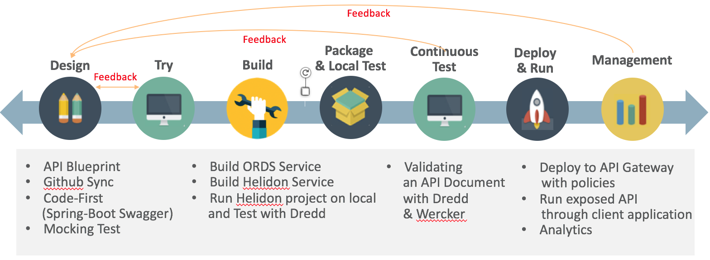
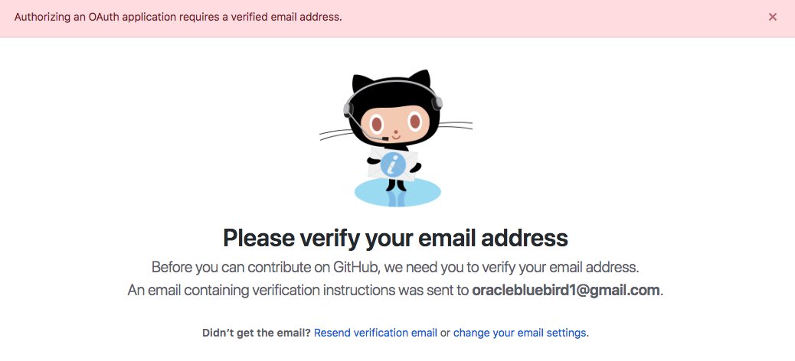
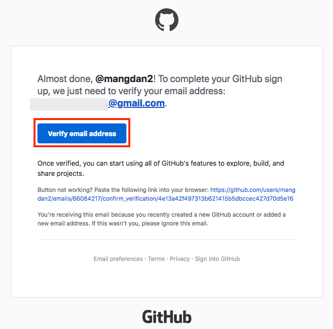
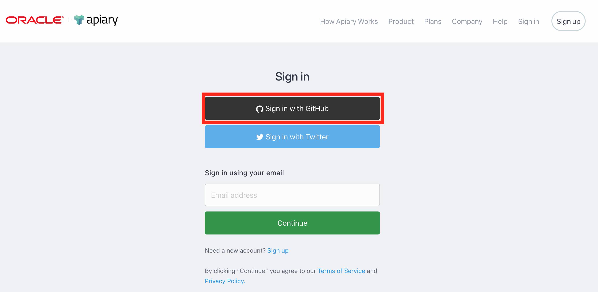
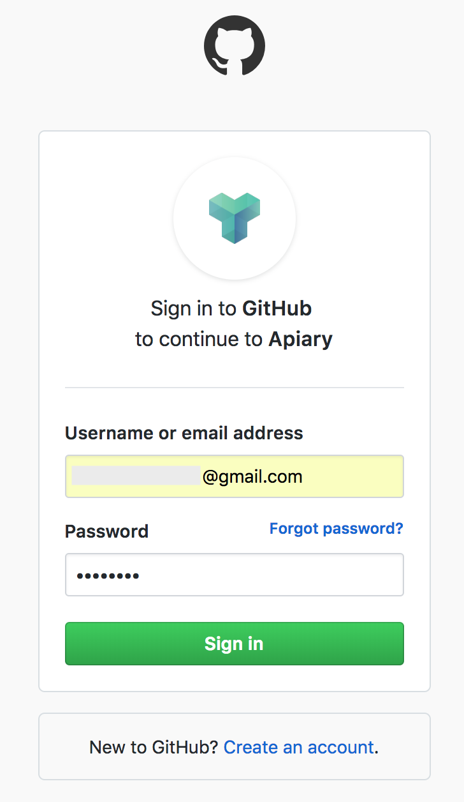
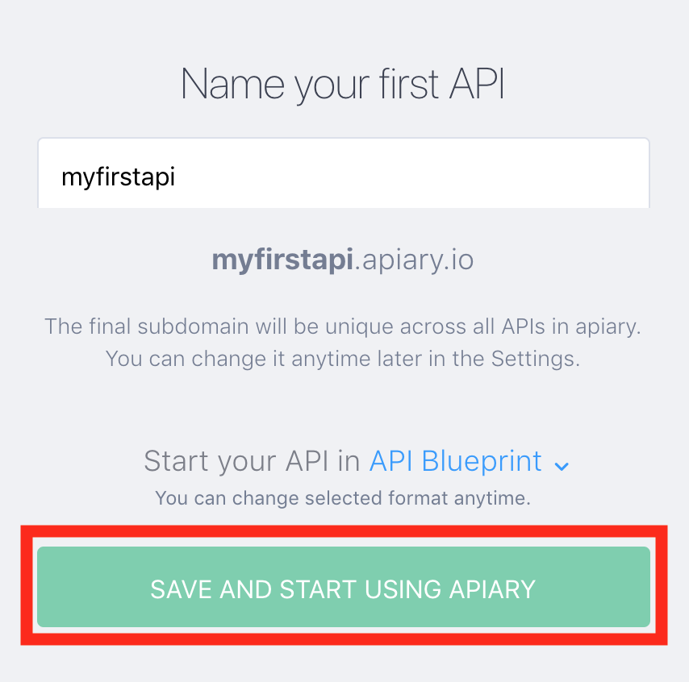
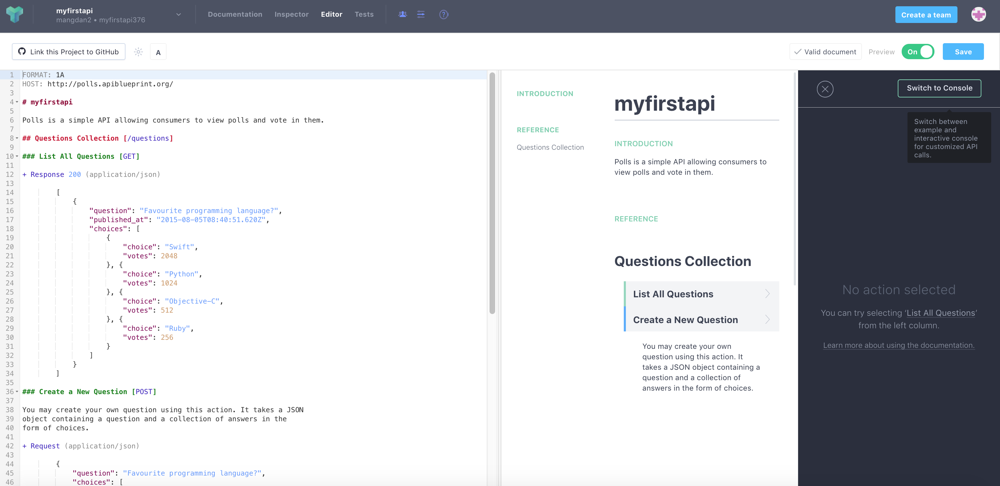
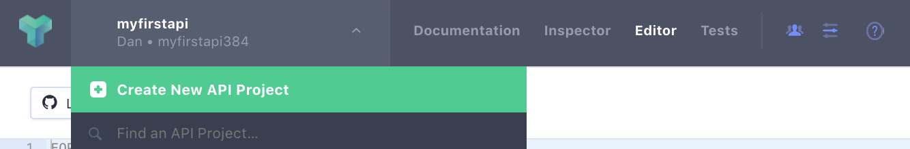
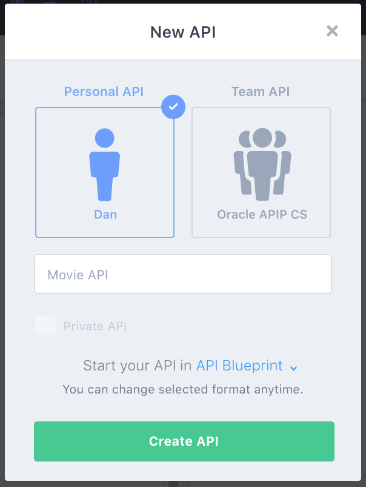

# 마이크로 서비스 개발을 위한 API 우선 설계 및 API 구축하기

본 문서는 Oracle Apiary에서 API Blueprint를 활용하여 API 문서를 만들고, 만들어진 문서를 토대로 [Oracle Helidon](http://helidon.io)과 [Oracle Database의 REST Data Service](https://www.oracle.com/database/technologies/appdev/rest.html)로 마이크로 서비스를 구현하는 것을 보여줍니다. 
또한 API 문서와 구현된 서비스간의 비호환 (서비스에 대응하는 문서 호환 여부) 여부를 확인, 검증하는 [Dredd](https://github.com/apiaryio/dredd) 도구과 CI/CD 도구인 [Wercker](https://app.wercker.com/)를 통합하여 API 비호환 테스트를 지속적으로 자동화하는 것을 방법을 보여줍니다.
마지막으로 컨테이너에 배포된 API에 보안 및 다양한 정책을 적용해 보고, 최종적으로 API Gateway에 배포하여 서비스와 문서를 애플리케이션 개발자에게 오픈하는 내용을 담고 있습니다.
본 문서를 통해 오라클 솔루션을 활용하여 마이크로 서비스 개발에 대한 전반적인 라이프사이클을 경험해 보실 수 있습니다.

## 데스크탑  설치 프로그램
* [Java SE Development Kit 8](https://www.oracle.com/technetwork/java/javase/downloads/jdk8-downloads-2133151.html)
* [Node.js](https://nodejs.org/ko/download)
* [Apache Maven](https://maven.apache.org/download.cgi)
* [Git](https://git-scm.com/download/win)
* [Visual Studio Code](https://code.visualstudio.com/download)
* [SQL Developer](https://www.oracle.com/technetwork/developer-tools/sql-developer/downloads/index.html)
* [Insomnia](https://insomnia.rest/download)

## Oracle Cloud 환경
* [Oracle Compute Cloud Service](https://cloud.oracle.com/ko_KR/compute)
* [Oracle Database Cloud Service](https://cloud.oracle.com/ko_KR/database)
* [Oracle API Platform Cloud Service](https://cloud.oracle.com/ko_KR/api-platform)

## 시나리오
1. Apiary에서 API Blueprint 작성하기
2. Helidon (MP)과 ORDS를 사용하여 서비스 개발하고 Dredd를 사용하여 API Blueprint와 Helidon 서비스간 호환 여부 검증 및 테스트하기
3. Wercker와 Dredd, Github을 사용하여 지속적 통합 환경 구축하기
4. API 서비스에 보안 및 정책을 적용하고 API Gateway에 서비스 배포하기



## Apiary 계정 생성하기
API 문서를 작성하고 Mock Test를 하기 위한 Apiary 계정을 생성하는 단계입니다.  
만약 계정을 가지고 있다면 이 단계를 건너뜁니다.  
먼저 [Apiary(https://apiary.io)](https://apiary.io) 홈페이지에 접속한 후 우측 상단의 **Sign up** 버튼을 클릭합니다.  


**Continue with GitHub** 버튼을 클릭합니다.  
GitHub 계정이 필요합니다. 만약에 없을 경우 [GitHub(https://github.com)](https://github.com)에서 계정을 생성하세요.  


GitHub 계정을 입력하고 **Sign In** 버튼을 클릭합니다.  


GitHub에서 verify를 위한 메일이 발송됩니다.  


GitHub 로그인 메일 계정으로 접속하여 verify 메일을 확인하고 **verify email address**를 클릭 합니다.  


다시 Apiary 홈페이지로 접속한 후 우측 상단의 **Sign In** 버튼을 클릭, **Continue with GitHub** 버튼을 클릭 합니다.  


GitHub 계정을 입력하고 **Sign In** 버튼을 클릭합니다.  


Apiary 계정을 생성하면 기본 API 하나를 생성해야 합니다.  
**Name your first API** 부분에 *myfirstapi* 혹은 *helloapiary* 와 같이 임의로 입력합니다.  


Apiary 계정을 성공적으로 생성하였습니다. :clap:  
아래 화면은 Apiary 에디터 화면으로 좌측이 에디터, 우측이 실시간으로 만들어지는 API 문서입니다.  


## API Blueprint 문서 만들기
이제 API 문서를 만들어보겠습니다.
좌측 상단의 API 이름을 클릭한 후 **Create New API Project**를 선택합니다.  


**Personal API**를 선택하고 API 이름은 **Movie API** 라고 입력합니다. 
문서 유형은 API Blueprint와 Swagger 2.0 스펙을 지원하는데, 여기서는 API Blueprint로 문서를 작성합니다.

> Personal API와 Team API
> 무료 계정을 사용할 경우 Personal API만 만들 수 있습니다. Personal API는 개인적인 용도이며, 작성된 API 문서는 외부에 공개됩니다. 
> Enterprise 버전을 구매할 경우 Team API를 만들 수 있습니다. Team API는 팀멤버를 구성하고 해당하는 팀멤버에게만 공유할 수 있습니다.


> API Blueprint와 Swagger는 API 문서 작성 시 가장 많이 사용되고 있는 API 문서 작성 언어입니다.
> API Blueprint는 MarkDown 형식으로 작성하며, 가장 작성하기 쉽고 이해하기 쉬운 언어이지만, 스텁이나 스니펫과 같은 코드 생성 
> 기능을 지원하지 않습니다. Swagger는 현재는 OAS(Open API Specification)라고 불리며(하지만 여전히 개발자들 사이에서는 
> Swagger로 불립니다.) YAML 혹은 JSON 형식으로 작성이 되며, 개발자에게 좀 더 친숙하고, 많은 내용을 담을 수 있기 때문에 비 개발자에게는 
> 다소 복잡하게 느껴질 수 있습니다. API Blueprint에 비해서 복잡하고 어렵지만, 다양한 언어의 스텁 코드를 생성할 수 있는 기능
> (Swagger Codegen)과 같은 기능을 제공하며, 이미 만들어져 있는 API에서 바로 Swagger 문서를 만들 수 있습니다
> (ex. spring-boot api -> swagger). 
> Swagger는 문서의 복잡성이 높기 때문에 문서를 먼저 만들고 API를 만들기 보다는 이미 만들어진 API에서 Swagger문서를 추출하는 
> 방식으로 더 많이 사용됩니다. 따라서, 일반적으로 Design First 를 말할때는 API Blueprint, Code First를 말할때는 Swagger를 
> 떠올리면 됩니다. (물론 Swagger가 더 익숙한 사용자라면 Swagger가 Design First Approach가 될 수 있습니다.)



생성을 하게 되면 좌측에 샘플 API Blueprint 마크다운과 에디터가 보이고, 우측에 HTML 문서가 보입니다. 


이제부터 Movie API 문서를 작성하겠습니다.  
:meme:**작성**  이라고 표기되어 있는 부분만 변경 또는 재작성합니다.  
**변경 전** 부분을 **변경 후** 부분으로 변경합니다. Copy & Paste 할때는 앞 +/- 는 제외합니다.
```diff
- 변경 전
+ 변경 후 또는 추가
```

API Blueprint 버전 정도로 생각하면 됩니다. 현재 API Blueprint spec은 1A revision 9 입니다.
```markdown
FORMAT: 1A
```

실제 서비스할 Production 서버의 주소입니다. 처음에는 Production 환경이 없기 때문에 변경하지 않습니다.
```markdown
HOST: http://polls.apiblueprint.org/
```

API 문서 이름입니다. 한글도 가능합니다.
```markdown
# Movie API
```

:memo:**작성** > API에 대한 설명, 소개를 적는 부분입니다. 아래와 같이 수정합니다.
```diff
- Polls is a simple API allowing consumers to view polls and vote in them.
+ 영화 정보를 제공하는 API 입니다.
```

:memo:**작성** > API에 대한 엔드포인트 URL입니다. 아래와 같이 수정합니다.
```diff
- ## Questions Collection [/questions]
+ ## Movies Collection [/movies]
```

:memo:**작성** > API 엔드포인트에 대한 Action (Method)를 정의합니다. 아래와 같이 수정합니다.
```diff
- ### List All Questions [GET]
+ ### List All Movies [GET]
```
<pre><code><del><span style="color:red">Hi</span></del> Hello, world!</code></pre>


:memo:**작성** > API 엔드포인트에 대한 Action (Method)를 정의합니다. 아래와 같이 수정합니다.
```diff
- + Response 200 (application/json)

-         [
-             {
-                 "question": "Favourite programming language?",
-                 "published_at": "2015-08-05T08:40:51.620Z",
-                 "choices": [
-                     {
-                         "choice": "Swift",
-                         "votes": 2048
-                     }, {
-                         "choice": "Python",
-                         "votes": 1024
-                     }, {
-                         "choice": "Objective-C",
-                         "votes": 512
-                     }, {
-                         "choice": "Ruby",
-                         "votes": 256
-                     }
-                 ]
-             }
-         ]
```

