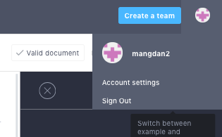
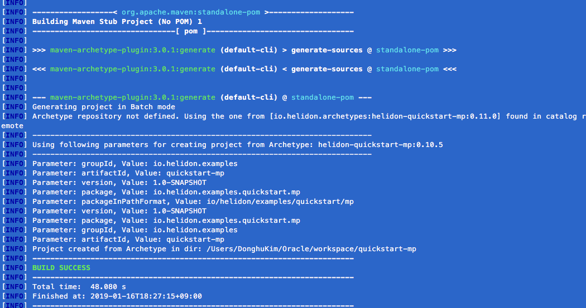
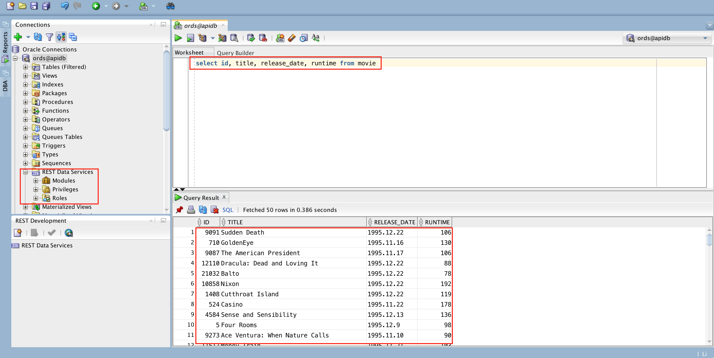
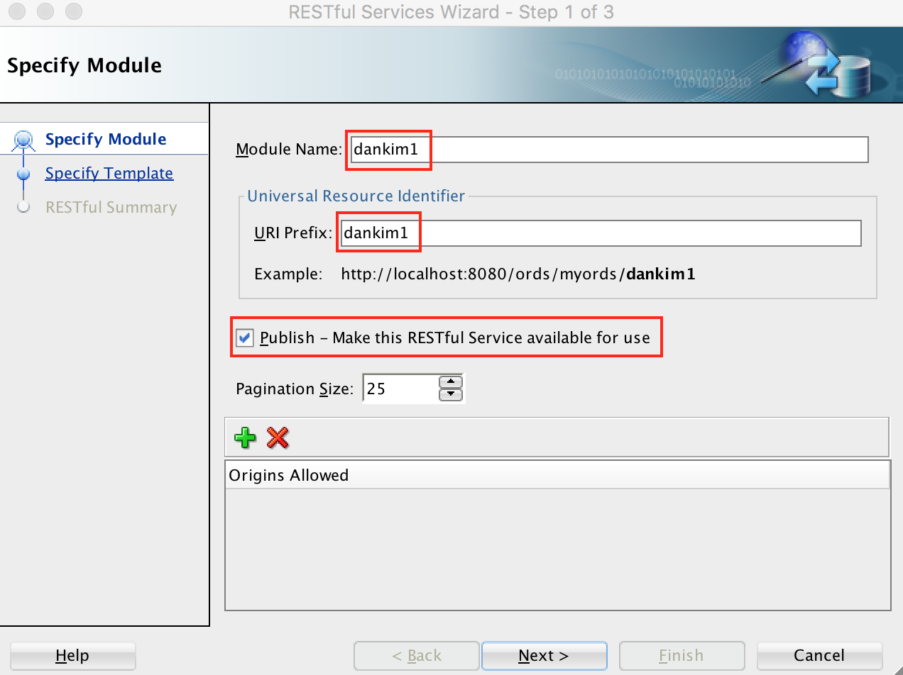
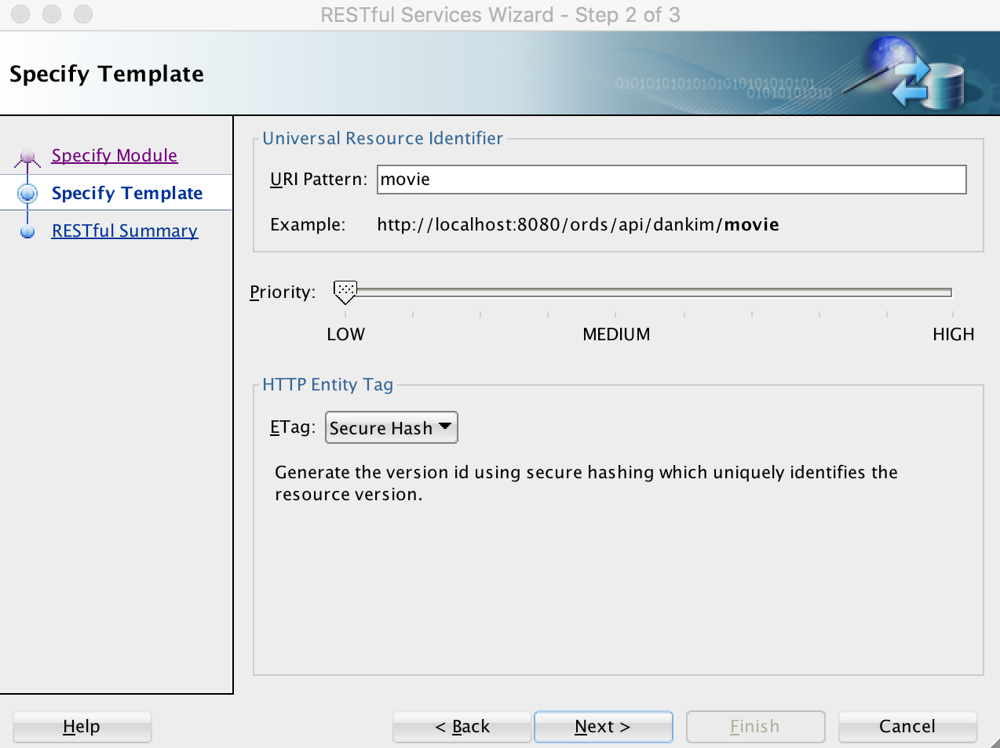
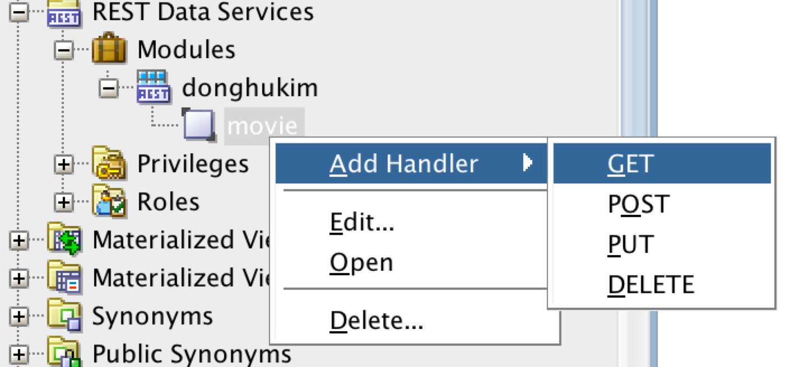
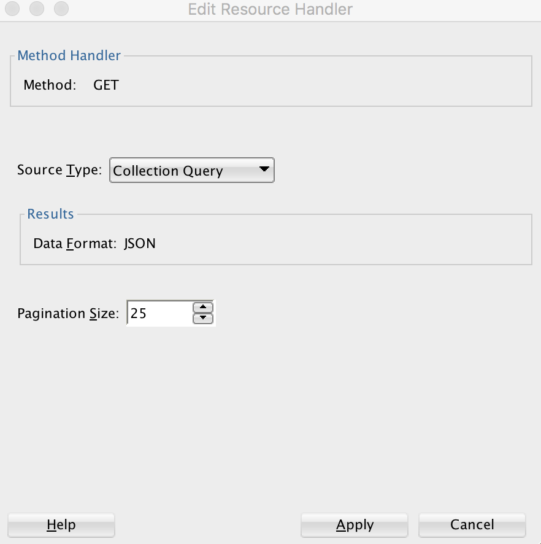
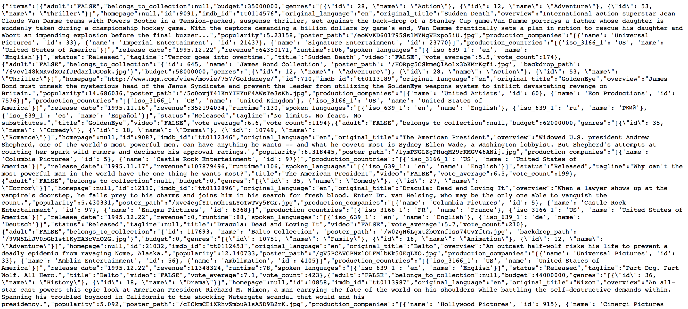

# 마이크로 서비스 개발을 위한 API 우선 설계 및 API 구축하기

본 문서는 Oracle Apiary에서 API Blueprint를 활용하여 API 문서를 만들고, 만들어진 문서를 토대로 [Oracle Helidon](http://helidon.io)과 [Oracle Database의 REST Data Service](https://www.oracle.com/database/technologies/appdev/rest.html)로 마이크로 서비스를 구현하는 것을 보여줍니다. 
또한 API 문서와 구현된 서비스간의 "동기화?" 비호환 (서비스에 대응하는 문서 호환 여부) 여부를 확인, 검증하는 [Dredd](https://github.com/apiaryio/dredd) 도구과 CI/CD 도구인 [Wercker](https://app.wercker.com/)를 통합하여 API 비호환 테스트를 지속적으로 자동화하는 것을 방법을 보여줍니다.
마지막으로 컨테이너에 배포된 API에 보안 및 다양한 정책을 적용해 보고, 최종적으로 API Gateway에 배포하여 서비스와 문서를 애플리케이션 개발자에게 오픈하는 내용을 담고 있습니다.
본 문서를 통해 오라클 솔루션을 활용하여 마이크로 서비스 개발에 대한 전반적인 라이프사이클을 경험해 보실 수 있습니다.

## 데스크탑  설치 프로그램
* [Java SE Development Kit 8](https://www.oracle.com/technetwork/java/javase/downloads/jdk8-downloads-2133151.html)
* [Node.js](https://nodejs.org/ko/download)
* [Apache Maven](https://maven.apache.org/download.cgi)
* [Git](https://git-scm.com/download/win)
* [Visual Studio Code](https://code.visualstudio.com/download)
* [SQL Developer](https://www.oracle.com/technetwork/developer-tools/sql-developer/downloads/index.html)
* [Insomnia](https://insomnia.rest/download)

## Oracle Cloud 환경
* [Oracle Compute Cloud Service](https://cloud.oracle.com/ko_KR/compute)
* [Oracle Database Cloud Service](https://cloud.oracle.com/ko_KR/database)
* [Oracle API Platform Cloud Service](https://cloud.oracle.com/ko_KR/api-platform)

## 시나리오
1. Apiary에서 API Blueprint 작성하기
2. Helidon (MP)과 ORDS를 사용하여 서비스 개발하고 Dredd를 사용하여 API Blueprint와 Helidon 서비스간 호환 여부 검증 및 테스트하기
3. Wercker와 Dredd, Github을 사용하여 지속적 통합 환경 구축하기
4. API 서비스에 보안 및 정책을 적용하고 API Gateway에 서비스 배포하기


## API 문서 작성하기
<details>
<summary>Apiary 계정 생성하기</summary>
API 문서를 작성하고 Mock Test를 하기 위한 Apiary 계정을 생성하는 단계입니다.  
만약 계정을 가지고 있다면 이 단계를 건너뜁니다.  

> [Apiary(https://apiary.io)](https://apiary.io) 홈페이지에 접속한 후 우측 상단의 **Sign up** 버튼을 클릭합니다.  
> 

> **Continue with GitHub** 버튼을 클릭합니다.  
> GitHub 계정이 필요합니다. 만약에 없을 경우 [GitHub(https://github.com)](https://github.com)에서 계정을 생성하세요.  
> 

> GitHub 계정을 입력하고 **Sign In** 버튼을 클릭합니다.  
> 

> GitHub에서 verify를 위한 메일이 발송됩니다.  
> 

> GitHub 로그인 메일 계정으로 접속하여 verify 메일을 확인하고 **verify email address**를 클릭 합니다.  
> 

> 다시 Apiary 홈페이지로 접속한 후 우측 상단의 **Sign In** 버튼을 클릭, **Continue with GitHub** 버튼을 클릭 합니다.  
> 

> GitHub 계정을 입력하고 **Sign In** 버튼을 클릭합니다.  
> 

> Apiary 계정을 생성하면 기본 API 하나를 생성해야 합니다.  
> **Name your first API** 부분에 *myfirstapi* 혹은 *helloapiary* 와 같이 임의로 입력합니다.  
> 

> Apiary 계정을 성공적으로 생성하였습니다. :clap:  
> 아래 화면은 Apiary 에디터 화면으로 좌측이 에디터, 우측이 실시간으로 만들어지는 API 문서입니다.  
> 
</details>

<details>
<summary>API Blueprint 프로젝트 만들기</summary>
이제 API 프로젝트를 하나 만들어 보겠습니다.

> 좌측 상단의 API 이름을 클릭한 후 **Create New API Project**를 선택합니다.  
> 

> **Personal API**를 선택하고 API 이름은 **Movie API** 라고 입력합니다.  
> 문서 유형은 API Blueprint와 Swagger 2.0 스펙을 지원하는데, 여기서는 API Blueprint로 문서를 작성합니다.
>>:warning: **참고 : Personal API와 Team API**  
>>Personal API는 무료 서비스로 개인만 작업이 가능하며, 팀단위 협업 기능은 지원하지 않습니다.  
>>또한 작성된 API 문서는 해당 문서의 URL만 알면 누구나 볼 수 있도록 공개됩니다.  
>>유료 서비스인 Enterprise 버전을 구매할 경우 팀 단위 협업이 가능한 Team API 문서를 생성할 수 있습니다.  
>>Team API는 팀멤버를 구성하고 팀멤버만 볼 수 있는 Private API로 구성할 수 있습니다. 

> 
>> :warning: **참고 : API Blueprint와 Swagger**  
>> API Blueprint와 Swagger는 API 문서 작성 시 가장 많이 사용되고 있는 API 문서 정의 언어입니다.  
>> 이외에 MuleSoft의 RAML(YAML)과 Slate(Markdown), Asciidoc (Spring-boot REST Doc 에서 기본으로 사용)  
>> 등이 있습니다. API Blueprint의 경우 API 문서를 생성하는데 포커스가 맞쳐져 있습니다. 반면에, Swagger는 API를  
>> 정의하는데 포커스가 맞춰져 있다고 볼 수 있습니다.  API Blueprint는 개발자가 아니어도 쉽게 배울 수 있으며, 작성하기  
>> 쉽고 이해하기 쉬운 마크다운 형식을 지원합니다.  
>> 문서를 위한 스펙이기 때문에 실제 구현을 위한 정의가 Swagger에 비해 상대적으로 많이 포함되지 않아, 스텁이나 스니펫과  
>> 같은 코드 생성 기능을 제공하기 어렵습니다. Swagger는 Linux Foundation의 오픈소스 프로젝트인 OpenAPI  
>> Initiative에 추가되면서 현재는 Open API Specification (OAS) 이라는 이름으로 불리고 있습니다.  
>> 개발자에게 친숙한 JSON, YAML 형식으로 작성하며, 구현을 위한 여러가지 스펙을 제공하기 때문에 개발자 사이에서 많이  
>> 사용되고 있으며, 다양한 언어의 스텁 코드를 생성할 수 있는 기능도 제공될 수 있습니다. (e.g. Swagger Codegen)  
>> 반면에 API Blueprint에 비해서 구현과 관련된 많은 내용이 포함되기 때문에 비 개발자에게는 다소 복잡하게 느껴질 수 있습니다.  
>> Swagger는 문서의 복잡성이 높기 때문에 문서를 먼저 만들고 API를 만들기 보다는 이미 만들어진 API에서 Swagger문서를  
>> 추출하는 방식으로 더 많이 사용됩니다. (ORDS를 포함 많은 개발 언어 및 프레임웍에서 Swagger 생성 기능을 제공합니다.)  
>> 따라서, 일반적으로 Design First 를 말할때는 API Blueprint, Code First를 말할때는 Swagger를  
>> 떠올리면 됩니다. (물론 Swagger가 더 익숙한 사용자라면 Swagger가 Design First Approach가 될 수 있습니다.)  

> 생성을 하게 되면 좌측에 샘플 API Blueprint 마크다운과 에디터가 보이고, 우측에 HTML 문서가 보입니다.  
> 
</details>

<details>
<summary>API Blueprint 문서 작성하기</summary>

이제부터 Movie API 문서를 작성하겠습니다.  
:memo: **마크가 표기되어 있는 부분만 수정 또는 추가합니다.**  

> API Blueprint 버전 정도로 생각하면 됩니다.  
> 현재 API Blueprint spec은 1A revision 9 입니다.  
> ```markdown
> FORMAT: 1A
> ```

> 실제 서비스할 Production 서버의 주소입니다.  
> 처음에는 Production 환경이 없기 때문에 변경하지 않습니다.
> ```markdown
> HOST: http://polls.apiblueprint.org/
> ```

> API 문서 이름입니다. 한글도 가능합니다.
> ```markdown
> # Movie API
> ```

> :memo:**API 설명 수정**  
> API에 대한 설명, 소개를 적는 부분입니다.  
> 수정 전 부분을 아래와 같이 수정합니다.  
> ***수정 전***
> ```diff
> - Polls is a simple API allowing consumers to view polls and vote in them.
> ```
> ***수정 후***
> ```markdown
> 영화 정보를 제공하는 API 입니다.
> ```

> :memo:**API 엔드포인트 수정**  
> API에 대한 엔드포인트 URL입니다.  
> 수정 전 부분을 아래와 같이 수정합니다.  
> ***수정 전***
> ```diff
> - ## Questions Collection [/questions]
> ```
> ***수정 후***
> ```markdown
> ## Movies Collection [/movies]
> ```

> :memo:**API 엔드포인트 Action 수정**  
> API 엔드포인트에 대한 Action (Method)를 정의합니다.  
> 수정 전 부분을 아래와 같이 수정합니다.  
> ***수정 전***
> ```diff
> + ### List All Questions [GET]
> ```
> ***수정 후***
> ```markdown
> ### List All Movies [GET]
> ```

> :memo:**응답 JSON 샘플 수정**  
> 응답 JSON 샘플을 다음과 같이 수정합니다.  
> ***수정 전***
> ```diff
> -        [
> -            {
> -                "question": "Favourite programming language?",
> -                "published_at": "2015-08-05T08:40:51.620Z",
> -                "choices": [
> -                    {
> -                        "choice": "Swift",
> -                        "votes": 2048
> -                    }, {
> -                        "choice": "Python",
> -                        "votes": 1024
> -                    }, {
> -                        "choice": "Objective-C",
> -                        "votes": 512
> -                    }, {
> -                        "choice": "Ruby",
> -                        "votes": 256
> -                    }
> -                ]
> -            }
> -        ]
> ```
> ***수정 후***
> ```markdown
>         [
>             {
>                 "id": 19995,
>                 "title": "Avatar",
>                 "year": "2009",
>                 "runtime" : 100
>             },
>             {
>                 "id": 2699,
>                 "title": "Titanic",
>                 "year": "1997",
>                 "runtime" :194
>             }
>         ]
> ```

두번 째 API Action을 수정 합니다.  
> :memo:**API Action 수정**  
> Action을 다음과 같이 수정합니다.
> ***수정 전***
> ```diff
> - ### Create a New Question [POST]
>
> - You may create your own question using this action. It takes a JSON
> - object containing a question and a collection of answers in the
> - form of choices.
> ```
> ***수정 후***
> ```markdown
> ### Get a Movie [GET /movies/{id}?{title}]
>
> Movie ID와 Title로 조회하여 상세 Movie 정보를 반환합니다.
> ```
>> :warning: **참고 : Path Parameter 와 Query Parameter**  
>> Path Parameter는 REST URL Path에 포함되는 파라미터로 http://{host}:{port}/{endpoint}/{path_param}/  
>> 형태로 사용되며 필수로 포함되어야 합니다.  
>> Query Parameter는 URL에 ?다음에 붙는 파라미터로 key=value 형태로 사용되며, 옵셔널한 값이 사용될 수 있습니다.  
>> 위 내용 중 {id} 부분이 Path Parameter를 의미하며, ?{title} 부분이 Query Parameter 입니다.  

> :memo:**요청 파라미터 수정**  
> Request 부분을 다음과 같이 수정합니다.
> ***수정 전***
> ```diff
> - + Request (application/json)
>
> -        {
> -            "question": "Favourite programming language?",
> -            "choices": [
> -                \"Swift\",
> -                \"Python\",
> -                \"Objective-C\",
> -                \"Ruby\"
> -            ]
> -        }
> ```
> ***수정 후***
> ```markdown
> + Parameters
>     - id : 19995 (string, required)
>     - title : Avatar (string, optional)
>
> + Request
>     + Header
>
>             Authorization : Basic AAA
> ```

> :memo:**응답 데이터 수정**
> Response 부분을 다음과 같이 수정합니다.  
> 수정 전
> ```diff
> - + Response 201 (application/json)
>
> -    + Headers
> -
> -            Location: /questions/2
>
> -    + Body
>
> -            {
> -                \"question\": \"Favourite programming language?\",
> -                \"published_at\": \"2015-08-05T08:40:51.620Z\",
> -                \"choices\": [
> -                    {
> -                        \"choice\": \"Swift\",
> -                        \"votes\": 0
> -                    }, {
> -                        \"choice\": \"Python\",
> -                        \"votes": 0
> -                    }, {
> -                        \"choice": \"Objective-C\",
> -                        \"votes": 0
> -                    }, {
> -                        \"choice": \"Ruby\",
> -                        \"votes": 0
> -                    }
> -                ]
> -            }
> ```
> *수정 후*
> ```markdown
> + Response 200 (application/json)
>     + Attributes
>         - id : 2699
>         - title : Titanic
>         - year : 1997
>         - runtime : 194
>         - Include MovieDetail
>         - genres (array[Genres])
>
>
>
> # Data Structure
>
> ## MovieDetail (object)
> - overview : In the 22nd century, a paraplegic Marine is dispatched to the moon Pandora on a unique mission, but becomes torn between following orders and protecting an alien civilization. (string)
> - releaseDate : 2009.12.10
> - status : Released
> - homepage : http://www.titanicmovie.com
> - vote_average : 7.2
> - vote_count : 12114
>
>
> ## Genres (object)
> - id : 18 (number, required)
> - name : Drama (string, required)
> ```
>> :warning: **참고 : MSON (Markdown Syntax for Object Notation)**  
>> 두번 째 API Action에 대한 요청/응답 데이터를 작성할 때 JSON 형태의 데이터가 아니어서 의아했을 거라고 생각됩니다.  
>> 하지만, Apiary 우측의 HTML 문서에서는 JSON으로 변환되어 보이는 것을 확인 할 수 있을 겁니다.
>> 이 데이터 정의 방식은 API Blueprint의 또하나의 데이터 정의 방식인 [MSON](https://apiblueprint.org/documentation/mson/specification.html) (Markdown Syntax for Object  
>> Notation) 이라는 스펙으로 JSON보다 간결한 방식으로 데이터를 작성할 수 있게 도와주는 스펙입니다.  
>> 비 개발자의 경우 JSON에 익숙하지 않은 경우가 많은데, 이 경우 MSON을 사용하면 좀 더 쉽게 문서 작성이 가능합니다.  
>> 또한, 변환된 HTML 문서에서는 JSON으로 변환되어 제공되기 때문에 개발자는 필요한 JSON 형태로 데이터를 확인할 수 있습니다. 
>> MSON으로 문서를 작성하면서, 우측의 HTML 문서를 보면 JSON으로 실시간 변환되는 것을 확인할 수 있습니다.
>> 기본적인 사용법은 다음과 같습니다.  
>>> ***+Parameters or +Attributes***  
>>>   ***- id : 1001 - 아이디 (number, required)*** 여기서 키 값인 id를 제외하고 옵셔널입니다.  
>>>   *id*는 키 값, *1001*은 샘플 값, *아이디*는 설명, *number*는 값 유형, *required*는 필수 여부를  
>>>   나타냅니다. 이 외에 ***# Data Structure*** 를 통해서 별도의 데이터 객체를 정의할 수 있으며, MSON에서  
>>>   ***Include*** 혹은 ***객체명***을 지정하여 사용 가능합니다.  
>>>   ***(e.g. Include MovieDetail, genres (array[Genres]), user(Person))***
</details>

<details>
<summary>API Blueprint GitHub에 푸시하기</summary>

작성된 API Blueprint 를 GitHub에 푸시해서 형상관리를 할 수 있습니다.
이 작업을 위해서는 Apiary와 GitHub Sync가 되어야 하는데, 이 과정을 보여줍니다.

> 먼저 GitHub에 Repository를 하나 생성합니다.   
> GitHub에 로그인한 후 New repository를 클릭합니다.  
> 

> Repository 이름을 입력합니다. 여기서는 *apiary_handson* 이라는 이름으로 생성합니다.  
> 

> 맨 아래 Import code를 클릭합니다.  
> 본 과정에서 사용되는 소스와 설정파일을 포함한 Repository를 복제하면서 생성합니다.  
> 

> clone URL에 ***https://github.com/mangdan/apiary_handson*** 을 입력하고, Begin Import를 클릭합니다.  
> 

> GitHub Repository가 생성되었습니다. Repository 링크를 클릭하면 Repository와 Import한 파일들을 확인 할 수 있습니다.  
> 

> 다시 Apiary로 돌아가서 우측 상단의 사용자 아이콘을 클릭한 후 Account settings를 클릭합니다.  
> 

> 다음과 같이 GitHub 계정 정보를 입력하고 Check connection with GitHub 을 클릭합니다.  
> *Nothing to check. You have no API connected with GitHub.* 라는 메시지가 나오면 성공입니다.  
> 

> 이제 Apiary 상단의 사람 모양 아이콘 옆 Settings 아이콘을 클릭합니다.  
> 이 Settings 는 작성한 문서에 대한 설정을 하기 위한 설정 버튼입니다.  
> 

> 맨 하단 *Link your GitHub account* 버튼을 클릭합니다.  
> 

> 맨 하단 *List all repositories* 버튼을 클릭합니다.  
> 

> *Authorize apairyio* 버튼을 클릭합니다.  
> 

> 다시 하단의 *Link your GitHub account* 버튼을 클릭하면 다음과 같이 repository를 선택할 수 있습니다.  
> 옆의 Connect 버튼을 클릭합니다.  
> 
 
> *Commit and start sync* 버튼을 클릭합니다.  
> 

> 작성한 API Blueprint문서와 GitHub Repository가 싱크되었습니다.  
> 

> 다시 상단의 Editor 버튼을 클릭하면 우측 Save 버튼 옆에 Push 버튼이 생성 된 것을 확인하실 수 있습니다.  
> 이제 문서를 변경하면 변경이 되었다는 알림(빨간점)이 Push 버튼에 나타나며, Push 버튼을 클릭하여 GitHub에 바로 푸시할 수 있습니다.  
> 

> GitHub Repository에는 apiary.apid 파일이 생성됩니다.  
> GitHub에 생성된 파일을 클릭하여 내용을 확인합니다.  
> 
</details>

## API 서비스 개발하기
<details>
<summary>Helidon MP (MicroProfile) 프로젝트 생성하기</summary>

> Windows Command 창을 열고 다음과 같이 환경 변수를 수정합니다.  
> 아래 Maven과 JDK는 자신의 PC 설치 위치를 확인하고 설정하여야 합니다.  
> ```
> setx path "%PATH%;c:\Oracle\apache-maven-3.6.0\bin"
> setx JAVA_HOME "c:\Program Files\Java\jdk1.8.0_202"
> ```

> Windows Command 창을 다시 열고 정상적으로 환경이 설정 되었는지 확인합니다.
> ```
> mvn -version
> echo %JAVA_HOME%
> ```

> c:\Oracle 폴더로 이동한 후 workspace 폴더를 생성하고,  
> 해당 폴더안에서 Helidon Template을 활용하여 Project를 생성합니다.  
> 여기서는 MicroProfile 기반 프로젝트를 생성합니다.  
> ```
> mkdir c:\Oracle\workspace
> cd c:\Oracle\workspace
> ```

> 아래 내용을 Copy & Paste 한 후 실행합니다.
> ```
> mvn archetype:generate -DinteractiveMode=false -DarchetypeGroupId=io.helidon.archetypes -DarchetypeArtifactId=helidon-quickstart-mp -DarchetypeVersion=0.11.0 -DgroupId=io.helidon.examples -DartifactId=quickstart-mp -Dpackage=io.helidon.examples.quickstart.mp
> ```
>> :warning: **참고 : 프로젝트 이름과 패키지 이름**  
>> 아래 내용은 변경이 가능한 부분입니다. 하지만 원활한 실습 진행을 위해 기본으로 생성하는 것을 권장합니다.  
>> **-DgroupId=io.helidon.examples**  프로젝트의 고유한 식별 값입니다. 변경 가능합니다.  
>> **-DartifactId=quickstart-mp**     프로젝트의 이름입니다. 해당 이름의 폴더가 생성되며, 패키징 될 경우 이 이름을 사용합니다. 변경 가능합니다.  
>> **-Dpackage=io.helidon.examples.quickstart.mp**  프로젝트의 기본 패키지 경로입니다. 변경 가능합니다.  

> 관련된 라이브러리와 메이븐 플러그인을 다운로드 받습니다.  
> 다운로드가 완료되면 다음과 같이 Build Success 화면을 볼 수 있습니다.  
> :warning: 최초 다운로드 받는 시간이 5분 이상 소요됩니다. 다운로드 받는 동안 다음 단계인 ORDS를 먼저 진행합니다.  
> 

> Helidon MP 프로젝트를 생성하는 동안 ORDS 실습을 진행합니다.  
> SQL Developer를 실행합니다.  
> ```
> {sqldeveloper 설치폴더}/bin/sqldeveloper.exe 더블 클릭 (혹은 바탕화면에 아이콘이 있을 경우 클릭)
> ```

> SQL Developer 좌측 상단의 + 버튼을 클릭하고 Connection을 생성 합니다.  
> 다음과 같이 입력하고, Connect 버튼을 클릭합니다.  
> ```
> Connection Name : **oracle@apidb**
> Username : **oracle**
> Password : **Welcome123!**
> Hostname : **ip (todo)**
> Port : **1521**
> SID : **apidb**
> ```
> <그림 추가>

> 좌측 생성된 Connect 이름을 마우스 우클릭 해서 ***Open SQL Worksheet*** 를 선택합니다.  
> Worksheet가 보이면 다음과 같이 쿼리를 입력하고 **Ctrl + Enter** 를 입력합니다.  
> ```
> SELECT * FROM MOVIE;
> ```

> 조회된 Movie 테이블의 데이트를 확인할 수 있습니다.  
> 좌측의 REST Data Services 옆 + 버튼을 클릭하여 확장하면 Modules, Privileges, Roles 가 있습니다.  
> 

> **Modules**를 마우스 우 클릭하고 **New Module**을 선택합니다.  
>> :warning: **참고**  
>> 여기선 Module과 Template이라는 것을 설정합니다.  
>> Module의 URI Prefix와 Template의 URI Pattern이라는 것을 순서대로 입력할 것입니다.  
>> 입력하게 되면 실제 REST 서비스의 주소는 다음과 같이 생성됩니다.   
>> 여기서 스키마Alias는 **oracle** 입니다.  
>>```
>> http://{ORDS서버주소}/{ORDS포트}/ords/{스키마Alias}/{Module_URI_Prefix}/{URI_Pattern}
>>```

> Module에서는 다음과 같이 입력합니다.   
> ```
> Module Name : **본인이름 영문명 (e.g donghukim)**
> URI Prefix : **본인이름 영문명 (e.g donghukim)**
> Publish - Make this RESTful Service available for use : **Check**
> ```
> 

> Next를 클릭하여 Template 설정을 합니다. 다음과 같이 입력합니다.
> ```
> URI Pattern : **movie**
> ```
> 

> Finish 버튼을 클릭하여 완료합니다.  
> 을 추가합니다.  
> 생성한 movie template을 클릭하고 마우스 우 클릭 후 Add Handler > GET 을 선택합니다.  
> 

> Apply를 선택합니다.
> 

> 쿼리를 다음과 같이 입력하고 바로 위 저장 버튼을 클릭합니다.
>```
> SELECT * FROM MOVIE;
>```

> 브라우저에서 다음과 같은 URL로 접속합니다. module uri prefix만 본인이 입력한 값으로 변경합니다.  
>```
> http://129.213.146.191:8080/ords/oracle/donghukim/movie
>```
> 다음과 같은 json 데이터가 나오면 성공입니다.
> 
</details>
